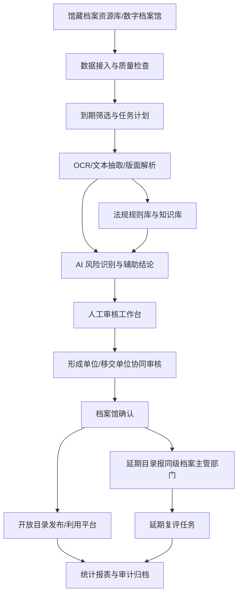

# 档案开放人工智能辅助鉴定系统调研报告

调研日期：2026-04-30  
调研对象：面向各级国家档案馆馆藏档案开放审核/开放鉴定的人工智能辅助系统。  
调研范围：国家现行法律法规与政策规范、公开可查的成熟实践/产品、相近开源软件与组件、完整系统功能画像。  
说明：本报告基于公开资料调研，未进行商业系统试用、源码审计或法律意见出具。后续设计阶段应由档案主管部门、保密部门、法务和业务专家共同确认本馆具体开放标准。

## 1. 结论摘要

档案开放不是简单的“满 25 年自动公开”。现行制度形成了“法定开放年限 + 开放审核 + 形成/移交单位协同 + 结果确认 + 延期目录报审 + 定期复评 + 利用规则公开”的闭环。人工智能系统只能做辅助鉴定，不能替代档案馆、形成单位、移交单位和档案主管部门的法定职责。

系统设计的核心目标应是：在不突破保密、国家安全、个人信息、知识产权、商业秘密和档案实体安全底线的前提下，提高到期档案筛选、风险识别、证据定位、协同审核、结果留痕和目录发布效率。

公开实践已经出现较成熟方向。福建省档案馆的人工智能辅助开放审核系统强调全流程在线处理、关键词统计、报表台账、AI 预测预分库和人工复核闭环；花都区、凉山州、台州市等地公开报道中也出现了“到期自动筛选、OCR+AI 初筛、敏感词/关键词识别、人工复核、多级审核、统计分析、开放目录发布”等共同能力。

开源生态没有可以直接拿来用的“中国档案开放 AI 鉴定系统”。ArchivesSpace、AtoM、DSpace、Archivematica 能支撑档案描述、发布或长期保存；PaddleOCR、Apache Tika、OpenSearch、Presidio、doccano/Label Studio、Flowable 等可作为 OCR、文本抽取、检索、敏感识别、标注训练、流程引擎组件。但本项目必须自建档案开放规则库、审核工作流、证据链、协同机制、安全隔离和本地模型治理。

建议第一阶段不直接做“大而全平台”，而是先建设“开放审核工作台 + AI 风险初筛 + 规则证据库 + 全流程留痕”的原型，用真实样本验证召回率、误报率、人工节省率和法规适配性。

## 2. 法律法规与政策规范

### 2.1 档案开放的直接依据

| 文件 | 现行要点 | 对系统的直接约束 |
|---|---|---|
| 《中华人民共和国档案法》 | 县级以上各级档案馆档案一般自形成之日起满 25 年向社会开放；经济、教育、科技、文化等类可少于 25 年；涉及国家安全、重大利益等可多于 25 年；馆藏档案开放审核由档案馆会同形成单位或移交单位共同负责；利用档案涉及知识产权、个人信息的应遵守相关法律。 | 系统必须支持到期筛选、少于/多于 25 年的分类策略、协同审核、知识产权和个人信息风险识别。 |
| 《中华人民共和国档案法实施条例》 | 国家档案馆应分期分批开放并公布目录；建立馆藏档案开放审核协同机制；尚未移交进馆档案由形成单位或保管单位负责开放审核，移交时附具到期开放意见、政府信息公开情况、密级变更情况等；到期不宜开放档案经国家档案馆报同级档案主管部门同意可延期。 | 系统必须记录形成/移交单位意见、政府信息公开情况、密级变化、延期报审、审批依据和协同过程。 |
| 《国家档案馆档案开放办法》 | 档案开放应遵循合法、及时、平等、便于利用原则；已满 25 年但涉及国家秘密、国家和社会重大利益、知识产权、个人信息、其他限制利用情形的可延期；开放程序包括计划、组织、审核、确认、公布；延期开放应定期评估。 | 系统工作流至少覆盖计划、任务组织、审核、结果确认、开放目录公布、延期复评。AI 推荐必须给出法定风险类别和证据。 |
| 《各级国家档案馆馆藏档案解密和划分控制使用范围的暂行规定》 | 仍是馆藏涉密档案解密和控制使用的重要参考之一，但业内已有修订需求讨论，应与新法、新条例和保密规定衔接使用。 | 可作为“控制使用/延期开放”历史规则来源之一，但不能机械照搬，需由主管部门确认本地适用口径。 |
| 《电子档案管理办法》 | 电子档案管理强调真实、完整、可用、安全；电子档案开放工作应符合国家法律法规有关规定。 | AI 处理不能破坏电子档案原件真实性、完整性；应产生审核副本、利用副本和处理记录。 |

关键来源：

- 《中华人民共和国档案法》：[国家市场监督管理总局转载全文](https://www.samr.gov.cn/zw/zfxxgk/fdzdgknr/bgt/art/2025/art_1b5ebeb5375f485789fd0e6bfe415a7f.html)
- 《中华人民共和国档案法实施条例》：[国家档案局](https://www.saac.gov.cn/daj/xzfg/202401/2ebf9e8cc94a4f6cbff5a8210f25dc88.shtml)
- 《国家档案馆档案开放办法》：[国家档案局](https://www.saac.gov.cn/daj/xzfgk/202207/9dc96f7f635247c18ae1a9ec15c24dea.shtml)
- 《各级国家档案馆馆藏档案解密和划分控制使用范围的暂行规定》：[国家档案局](https://www.saac.gov.cn/daj/xzfgk/202112/6be633f92fd144ce95a59faa122e0ce0.shtml)
- 《电子档案管理办法》：[中国政府网公报](https://www.gov.cn/gongbao/2024/issue_11746/202412/content_6991650.html)

### 2.2 保密、解密与国家安全

| 文件 | 现行要点 | 对系统的直接约束 |
|---|---|---|
| 《中华人民共和国保守国家秘密法》及实施条例 | 2024 年修订保密法自 2024-05-01 施行，实施条例自 2024-09-01 施行；涉及国家秘密的管理、利用、变更和解密应按保密法律法规办理。 | 涉密档案不能进入普通非涉密 AI 环境；模型、向量库、日志、缓存、训练样本均要按密级管理。 |
| 《国家秘密定密管理规定》 | 2025-05-01 施行；明确原始定密、派生定密、国家秘密确定/变更/解除等；拟移交各级国家档案馆且仍在保密期限内的国家秘密档案，应进行解密审核。 | 系统应记录定密、变更、解密审核状态；对未解密或条件未达成档案强制阻断开放建议。 |
| 《国家秘密解密暂行办法》 | 国家保密局公开稿强调保密期限届满前必审核、信息公开前必审核、移交各级国家档案馆前必审核，并与档案管理、信息公开机制结合；其适用应与 2025 年《国家秘密定密管理规定》等现行规定衔接。 | 开放审核系统应与解密审核状态联动，不能把“期限届满”误判为“已解密可开放”。 |
| 《中华人民共和国国家安全法》《中华人民共和国反间谍法》 | 维护国家安全是所有组织和公民义务；涉及国家安全、情报、反间谍工作秘密等内容具有高风险。 | AI 风险分类应包含政治安全、国防、外交、国家安全机关工作、公共安全、关键基础设施、重要数据等维度。 |

关键来源：

- 《中华人民共和国保守国家秘密法》：[中国政府网](https://www.gov.cn/yaowen/liebiao/202402/content_6934648.htm)
- 《中华人民共和国保守国家秘密法实施条例》：[中国政府网](https://www.gov.cn/zhengce/content/202407/content_6963933.htm)
- 《国家秘密定密管理规定》：[国家保密局](https://www.gjbmj.gov.cn/n1/2025/1212/c461457-40623278.html)
- 《国家秘密解密暂行办法》：[国家保密局](https://www.gjbmj.gov.cn/n1/2025/1212/c461456-40623363.html)
- 《中华人民共和国国家安全法》：[中国政府网](https://www.gov.cn/c16762/2015-07/01/content_2893902.htm)
- 《中华人民共和国反间谍法》：[国家保密局](https://www.gjbmj.gov.cn/n1/2023/0802/c409088-40049143.html)

### 2.3 政府信息公开、个人信息、数据安全与 AI 合规

| 文件 | 现行要点 | 对系统的直接约束 |
|---|---|---|
| 《中华人民共和国政府信息公开条例》 | 坚持公开为常态、不公开为例外；建立公开审查机制；不能确定是否公开时应报主管部门或保密行政管理部门确定；不公开信息需动态评估。 | 档案开放系统应能对接政府信息公开状态，记录公开审查、不可公开原因、复评周期。 |
| 《中华人民共和国个人信息保护法》 | 国家机关处理个人信息应有法定职责依据并依法履行告知、最小必要、安全保护等义务；敏感个人信息需更严格保护；公开个人信息要谨慎。 | 系统要识别自然人身份、敏感个人信息、未成年人信息、家庭成员、健康、金融账户、行踪等，并支持脱敏后开放或延期。 |
| 《中华人民共和国民法典》人格权编 | 保护隐私权和个人信息权益。 | 历史档案中的隐私、个人生活安宁、私密信息不能因到期而当然公开。 |
| 《中华人民共和国数据安全法》《网络数据安全管理条例》 | 数据处理包括收集、存储、使用、加工、传输、提供、公开、删除等；实行分类分级保护；重要数据、核心数据、个人信息和国家秘密有更严格要求；国家机关不履行网络数据安全保护义务将承担责任。 | 系统应有数据分类分级、等保/密评、访问控制、加密、备份、应急响应、日志审计和数据出境限制。 |
| 《中华人民共和国网络安全法》 | 网络运营者应履行网络安全保护义务；涉密网络还须遵守保密法律法规。 | 档案馆内部审核系统、政务外网服务、互联网开放目录平台应分区分域建设。 |
| 《生成式人工智能服务管理暂行办法》《互联网信息服务深度合成管理规定》《互联网信息服务算法推荐管理规定》 | 主要规制面向公众提供的生成式 AI、深度合成和算法推荐服务，同时强调国家安全、个人信息、数据安全、透明度和备案等要求。 | 本系统若仅在档案馆内网作业务辅助，通常不等同公众生成式 AI 服务；若面向公众提供智能问答、摘要、推荐，应另行评估备案、安全评估、内容审核和标识义务。 |

关键来源：

- 《中华人民共和国政府信息公开条例》：[中国政府网转载](https://www.gc.gov.cn/columns/c366fb5a-39d1-482d-8611-28eda5f83252/202004/04/9e3c8b2f-d421-4a9c-8137-e93afff52a31.html)
- 《中华人民共和国个人信息保护法》：[中国人大网](https://www.npc.gov.cn/WZWSREL25wYy9jMi9jMzA4MzQvMjAyMTA4L3QyMDIxMDgyMF8zMTMwODguaHRtbD9yZWY9aW1i)
- 《中华人民共和国数据安全法》：[地方政府转载全文](https://ggzy.gzlps.gov.cn/zfxxgk/fdzdgknr/zcfg_5750560/202107/t20210730_69355080.html)
- 《网络数据安全管理条例》：[国家网信办](https://www.cac.gov.cn/2024-09/30/c_1729384452307680.htm)
- 《中华人民共和国网络安全法》：[工业和信息化部](https://www.miit.gov.cn/ztzl/rdzt/tdzzyyhlwsdrhfzjkjstggyhlwpt/zcfb/art/2020/art_41be9e94ecc5433899ca88a0339a38b6.html)
- 《生成式人工智能服务管理暂行办法》：[工信部 PDF](https://www.miit.gov.cn/api-gateway/jpaas-web-server/front/document/file-download?fileName=0a6b306b8cab49e99ebd5e6dfef37637.pdf&fileUrl=%2Fcms_files%2Ffilemanager%2F1226211233%2Fattach%2F20238%2F0a6b306b8cab49e99ebd5e6dfef37637.pdf)
- 《互联网信息服务深度合成管理规定》：[工业和信息化部](https://www.miit.gov.cn/zcfg/xxtxl/art/2023/art_2f2790829e49443ba20a8a2f6d5b45dc.html)
- 《互联网信息服务算法推荐管理规定》：[中国政府网](https://www.gov.cn/zhengce/2022-01/04/content_5728941.htm)

### 2.4 数字档案馆建设标准趋势

国家档案局 2025 年发布的《推进数字档案馆建设实施办法（试行）》及其指标表，把“运用人工智能、数据分析等技术辅助开展档案开放、销毁等鉴定功能，及工作流程设定等管理功能”列入应用软件系统功能指标。这说明 AI 辅助开放审核已经从局部探索进入数字档案馆能力建设评价视野。

关键来源：

- 《推进数字档案馆建设实施办法（试行）》：[国家档案局](https://www.saac.gov.cn/daj/tzgg/202503/3d1cbfbab73f4738985c25c49303bcb5.shtml)
- 《数字档案馆建设指南》：[国家档案局转载](https://daj.nantong.gov.cn/ntsdaj/ywzd/content/444f42d5-1bdf-4854-b3c9-f8eafe2edd1a.html)
- 《数字档案馆系统测试办法》：[国家档案局](https://www.saac.gov.cn/daj/daxxh/201807/6d6180ef50e246e9b552f6c289e96eb2.shtml)

## 3. 成熟系统与公开实践调研

### 3.1 政府档案馆实践

| 案例 | 公开资料体现的功能 | 对本项目的启发 |
|---|---|---|
| 福建省档案馆人工智能辅助档案开放审核系统 | 已投入开放审核工作；支持全流程在线处理、关键词大数据统计、报表台账、平台数据对接转换；对 OCR 识别率高的数字档案进行 AI 预测和自动预分库，形成拟开放库、拟控制库等；强调人工复核和审核机制。 | 可作为完整业务闭环的参考：不是单点模型，而是“数字档案 + 规则 + AI 初判 + 人工审核 + 报表台账 + 结果库”。 |
| 北京市昌平区档案馆 | 国家档案局公开报道其探索人工智能辅助档案开放鉴定技术应用，建设辅助鉴定系统，形成“人工智能+”开放审核模式。 | 说明区县级档案馆也有 AI 辅助开放审核需求，系统不能只按省级馆大规模资源设计。 |
| 广州市花都区国家档案馆 | 数字档案馆系统与 AI 鉴定系统集成，自动筛选到期档案并指引制定鉴定任务计划，自动识别关键字、敏感词，对档案预分类和初判，并可分析已完成鉴定数据优化词库和算法模型。 | 到期筛选、任务计划、敏感词、预分类、反馈学习是基层可落地的核心组合。 |
| 凉山州档案馆 | 构建“OCR 识别 + AI 初筛 + 人工复核”审核模式，试用人工智能档案审核系统，筛选档案并实现内容智能分类；同时扩展开放档案查阅利用功能，开放目录在多平台查询。 | 应把 AI 审核与开放目录/全文利用平台联动，避免审核成果停留在内部台账。 |
| 台州市档案馆 | AI 智能开放审核系统依托局域网，搭载通义千问大模型，通过馆藏开放数据训练；形成智能初审、人工复审、形成单位审核、档案馆审核、档案局审批、开放审核领导小组审核的六步流程；嵌入多维统计分析。 | 大模型可用于语义风险识别，但必须在局域网和多级审批下运行；六步流程可作为强合规版本参考。 |

关键来源：

- 福建省案例文章：[参考网转载《浙江档案》文章](https://m.fx361.cc/news/2022/1119/13058315.html)
- 北京昌平案例：[国家档案局](https://www.saac.gov.cn/daj/xwdt/202406/8fdd81300db74889a2e6d92b8bef3812.shtml)
- 花都区案例：[广州市花都区政府](https://www.huadu.gov.cn/hdzx/bmdt/content/post_10531745.html)
- 凉山州案例：[凉山州政务服务网](https://lsz.sczwfw.gov.cn/art/2025/4/3/art_18014_283230.html)
- 台州市案例：[台州市档案馆](https://szb.taizhou.gov.cn/sycx/da/art/2025/art_72a593fd446743d89474b079c5b05a63.html)

### 3.2 商业产品与解决方案

| 产品/厂商 | 公开资料体现的能力 | 可借鉴点 | 注意点 |
|---|---|---|---|
| 云讯技术智能鉴定系统 | 针对文书档案、声像档案、专业档案进行智能辅助鉴定；基于深度学习和数据分析，对档案原文数据进行文本分析，提取与鉴定标识属性强关联的词生成智能词库。 | “档案门类 + 原文分析 + 鉴定标识 + 智能词库”是行业产品常见能力。 | 公开资料偏产品介绍，需实测准确率、可解释性和合规流程。 |
| 软云 AI 档案数字化平台 | 自动著录、自动图片质检、自动开放鉴定审核；宣称可根据审核要求自动判定是否开放并提供依据条目；强调本地化部署和高吞吐。 | 将 OCR/版面理解、著录、质检、开放审核放在同一生产线，适合数字化加工场景。 | 营销指标需用本馆样本复测；“自动判定”在本项目中只能定位为辅助建议。 |
| 档案大师/档案宝相关方案 | 公开宣传有智能开放审核鉴定系统，强调 AI 技术辅助高效管理。 | 说明市场已有面向档案开放审核的垂直方案。 | 部分页面由厂商大模型生成，信息颗粒度不足，采购前需获取真实产品演示和案例材料。 |
| 数字档案馆一体化平台类厂商 | 通常覆盖收集、接收、整理、保管、鉴定、统计、编研、利用等全流程，并在近年加入 AI 鉴定、智能检索、数据分析模块。 | 本项目应优先考虑与既有数字档案馆系统集成，而不是重建全量档案管理系统。 | 既有平台的“鉴定”可能偏保管期限/销毁鉴定，不一定满足开放审核法规细节。 |

关键来源：

- 云讯技术智能鉴定系统：[云讯技术](https://yunwise.cn/identify/)
- 软云 AI 档案数字化平台：[软云](https://www.deepdocument.cn/)
- 档案大师智能开放审核鉴定系统：[档案大师](https://www.dangandashi.com/news/46143.cshtml)
- 北京远洋科技数字档案馆方案：[北京远洋科技](https://oceanl.com/qyjt/1581.html)

### 3.3 成熟系统共同功能模式

公开案例和产品大体收敛到以下模式：

1. 数据基础：已有数字化副本、OCR 文本、文件级目录和较完整元数据。
2. 到期筛选：按形成时间、保管期限、档案门类、形成单位自动生成开放审核任务。
3. 规则初筛：密级、文种、题名、关键词、敏感词、形成单位、历史控制范围、政府信息公开状态。
4. AI 初判：OCR/版面识别、实体识别、语义分类、敏感片段定位、风险类别预测。
5. 人工审核：初审、复审、终审或多单位协同，处理 AI 证据和分歧。
6. 结果确认：开放、延期开放、控制利用、暂缓提供、脱敏后开放、需外部确认。
7. 结果发布：开放目录公布，开放档案进入查询利用平台。
8. 统计复盘：按全宗、年度、形成单位、风险类别、审核进度、开放比例生成报表。
9. 反馈迭代：人工结果反哺词库、规则和模型。

## 4. 开源软件与组件评估

### 4.1 档案管理与开放发布类

| 项目 | 主要能力 | 可复用价值 | 缺口 |
|---|---|---|---|
| ArchivesSpace | 开源、浏览器式档案信息管理系统；支持接收、整理描述、保存、访问；有工作人员界面、公众界面、API；支持 EAD、EAC-CPF、MARCXML、METS、MODS、Dublin Core 等导入导出。 | 可借鉴档案描述、权限、公众发布和 API 设计。 | 不内置中国档案开放审核法规、AI 风险识别、多单位协同审批。 |
| AtoM / Access to Memory | 开源、多语言、Web 化档案描述和访问软件。 | 可借鉴多语种档案目录发布、ICA 标准描述和公众检索体验。 | 偏档案描述与访问，不是开放鉴定系统。 |
| DSpace | 开源数字资源仓储，支持细粒度群组访问控制。 | 可借鉴开放资源库、访问控制、元数据和长期访问。 | 面向机构知识库/数字资源，不解决档案到期开放审核。 |
| Archivematica | 开源数字保存系统，符合 OAIS，支持 ingest、AIP、METS、PREMIS、BagIt 等长期保存流程。 | 可作为电子档案长期保存、格式标准化和保存包思路参考。 | 偏保存，不负责开放审核、敏感识别和协同审批。 |

关键来源：

- ArchivesSpace：[官网功能页](https://archivesspace.org/features)
- AtoM：[AtoM Foundation](https://accesstomemoryfoundation.org/AtoM)
- DSpace：[官网功能页](https://dspace.org/features/)
- Archivematica：[官网](https://www.archivematica.org/en/)

### 4.2 AI、OCR、敏感识别与标注类

| 项目 | 主要能力 | 可复用价值 | 缺口 |
|---|---|---|---|
| PaddleOCR | 开源 OCR 与文档解析，适合中文、多语种、版面、表格等场景。 | 可作为扫描档案、图片档案、PDF 图像层的文字识别和版面解析基础。 | 历史手写、低质扫描、繁体旧档、印章覆盖等仍需专项评测。 |
| Apache Tika | 可检测并抽取上千种文件类型的文本和元数据。 | 可作为 Office、PDF、HTML、邮件、图片元数据等抽取入口。 | 不负责档案语义鉴定；复杂扫描件需结合 OCR。 |
| Microsoft Presidio | PII 识别和匿名化框架，支持规则、NER、上下文、图像匿名化等；官方提示自动检测不能保证找全。 | 可作为个人信息识别/脱敏引擎参考，扩展中国证件、档案号、案号、单位职务等识别器。 | 默认实体和语境偏通用/英语，不能直接满足中国政务档案高召回要求。 |
| doccano | 开源文本标注工具，支持文本分类、序列标注、序列到序列任务，具备协作、API、多语言支持。 | 适合建设本馆样本库，标注“可开放/延期/脱敏/风险类别/敏感片段”。 | 只是标注工具，不含生产审核流程和模型治理。 |
| Label Studio | 开源多模态数据标注平台，支持文本、图像、音频、视频、NER、分类等。 | 适合标注扫描件区域、图像敏感目标、OCR 错误、跨模态样本。 | 标注平台不等于合规业务系统。 |
| OpenSearch | 开源搜索与分析引擎，支持全文检索和向量检索。 | 可用于档案全文检索、敏感词命中、相似案例检索、语义召回。 | 需严格隔离索引、权限、日志和向量数据；不能把非开放全文索引暴露到外网。 |
| Flowable | 开源 BPMN/CMMN/DMN 工作流引擎。 | 可承载计划、初审、复审、形成单位协同、档案馆确认、档案主管部门报审、延期复评等流程。 | 需自建档案业务表单、权限、证据链和国产化适配。 |

关键来源：

- PaddleOCR 技术报告：[arXiv](https://arxiv.org/abs/2507.05595)
- Apache Tika：[官网](https://tika.apache.org/)
- Microsoft Presidio：[文档](https://microsoft.github.io/presidio/)
- doccano：[GitHub](https://github.com/doccano/doccano)
- Label Studio：[官网](https://labelstud.io/)
- OpenSearch 向量检索：[文档](https://docs.opensearch.org/latest/vector-search/)
- Flowable：[开源文档](https://www.flowable.com/open-source/docs/bpmn/ch02-GettingStarted/)

### 4.3 开源评估结论

开源组件适合组成技术底座，但不适合直接作为本项目成品：

- 档案描述/发布系统解决“怎么管理和访问档案目录”，不解决“依据中国法规能否开放”。
- OCR/文本抽取系统解决“看见内容”，不解决“是否应延期开放”。
- PII 工具解决部分个人信息识别，不覆盖国家秘密、工作秘密、国家安全、社会稳定、商业秘密、知识产权和档案形成背景。
- 标注工具解决训练数据建设，不解决生产审批、协同确认、审计追责。
- 工作流引擎解决流程编排，不内置档案业务规则。

因此，更可行的方案是：以现有数字档案馆系统为资产和利用底座，组合开源 OCR/抽取/检索/标注/流程组件，自建“档案开放法规规则库 + AI 辅助鉴定模型 + 审核工作台 + 证据链审计”。

## 5. 完整系统功能画像

### 5.1 总体架构

### 5.2 数据接入与资源准备

必备功能：

- 接入现有数字档案馆、馆藏资源管理系统、电子文件归档系统、OA/公文系统、全文库、图像库、目录库。
- 支持按全宗、档案门类、年度、形成单位、保管期限、密级、开放状态、数字化状态批量筛选。
- 自动识别形成时间满 25 年档案，并支持经济、教育、科技、文化等门类提前开放策略。
- 支持捐献、寄存、归属不明、跨馆权属档案的特殊开放约束。
- 检查数字化质量：缺页、页序、OCR 置信度、图像清晰度、版面异常、全文挂接缺失。
- 保持原件、副本、OCR 文本、AI 分析结果、人工意见之间的稳定关联。

### 5.3 法规规则库

规则库应至少包含：

- 法律法规条款库：档案法、实施条例、开放办法、保密法、政府信息公开条例、个人信息保护法、数据安全法等。
- 开放条件：满 25 年、少于 25 年可开放门类、本馆权限、复制件利用、目录公布。
- 延期情形：国家秘密未解密、国家安全/社会稳定重大利益、知识产权、个人信息、第三方合法权益、法律法规另有限制。
- 暂缓提供情形：破损、字迹褪变、修复未完成、复制件不可用、实体利用可能造成损害。
- 协同规则：形成单位、移交单位、继续行使职权单位、档案主管部门、保密部门的参与条件。
- 地方规则：本省/本市档案开放细则、馆内审核口径、历史控制使用规则。
- 规则版本：生效日期、失效日期、解释部门、适用门类、审批记录。

### 5.4 AI 辅助识别能力

AI 不是只做敏感词匹配，应形成多层识别：

- 显性标识识别：密级、保密期限、解密条件、文号、案号、档号、审批号、合同号。
- 国家安全类识别：国防、外交、国家安全机关、公安政法、反间谍、重点工程、关键基础设施、应急处置、网络拓扑、地理坐标、重要数据。
- 个人信息识别：姓名、身份证号、出生日期、民族、籍贯、政治面貌、职务、家庭成员、住址、电话、健康、财产、未成年人信息。
- 知识产权与商业秘密识别：专利、技术方案、工艺参数、商业合同、供应商价格、财务数据、经营策略。
- 社会稳定与公共安全识别：群体性事件、信访、治安案件、刑事侦查线索、未公开事故调查、内部处置方案。
- 图像敏感目标识别：人脸、证件、签名、印章、手印、二维码、车牌、图纸关键区域。
- 语义风险识别：没有敏感词但上下文表明不宜开放的内容。
- 相似案例检索：查找历史审核中相似档案的处理结论和依据。

输出结果应包含：

- AI 建议结论：拟开放、拟延期开放、拟控制利用、拟脱敏后开放、拟暂缓提供、需形成单位确认、需保密部门确认。
- 风险类别：国家秘密、国家安全/重大利益、个人信息、知识产权/商业秘密、实体安全、权属限制、其他。
- 证据定位：页码、段落、坐标、命中词、相似案例、引用规则。
- 置信度与优先级：高风险低置信也应进入人工重点复核。
- 可解释说明：为什么给出该建议，依据哪条规则或哪类历史案例。

### 5.5 审核工作流

建议支持以下标准流程，并可配置裁剪：

1. 年度/批次计划：制定开放审核方案，明确范围、目标、人员、时间、质量抽检规则。
2. 到期任务生成：系统按规则生成待审核任务。
3. AI 初筛：形成预分类库和风险清单。
4. 人工初审：审核员查看原文、OCR、AI 证据，给出初审意见。
5. 人工复审：复审员重点处理高风险、低置信、分歧和抽检样本。
6. 形成单位/移交单位协同：在线征求意见、补充依据、处理逾期和撤并单位情形。
7. 档案馆确认：形成最终开放审核结果。
8. 延期目录报审：延期向社会开放的档案目录报同级档案主管部门审核。
9. 公布开放目录：向网站、开放档案查询利用平台或政务媒体发布。
10. 延期复评：对延期开放档案按周期重新评估。

### 5.6 审核工作台

面向档案工作人员的界面应突出效率和证据：

- 左右分屏：原始图像/OCR 文本/目录元数据/AI 证据同步定位。
- 高亮风险：按颜色区分国家秘密、个人信息、知识产权、商业秘密、权属等。
- 快捷判定：开放、延期、脱敏后开放、暂缓、退回补充、提交协同。
- 批量处理：对同一全宗、同一形成单位、同一文种批量建议，但必须支持逐件抽检。
- 分歧处理：AI 与人工、初审与复审、档案馆与形成单位意见不一致时形成专门队列。
- 法规提示：显示相关条款、馆内规则、历史相似案例。
- 质量抽检：按风险、人员、全宗、随机比例抽样复核。
- 可访问性：适配大批量审核的快捷键、批注、过滤、排序和进度提醒。

### 5.7 脱敏后开放

很多档案不是“全开放/全延期”二选一。系统应支持“部分开放”：

- 文本脱敏：姓名、证件号、电话、地址、账号等按规则遮盖或删除。
- 图像脱敏：人脸、证件、签名、印章、二维码、车牌、图纸敏感区域遮盖。
- PDF/OFD 真删除：不能只覆盖黑框；要清理隐藏文本、OCR 层、批注、附件、元数据。
- 脱敏件复核：输出后再次 OCR/文本抽取，检查敏感信息残留。
- 原件保护：公开利用只使用复制件或脱敏件，原件不直接面向公众。
- 对应关系保护：原件和脱敏件映射仅限授权人员使用。

### 5.8 安全与合规

系统安全要求应按高风险政务系统设计：

- 部署边界：涉密档案在涉密环境处理；非涉密但未开放档案建议在档案馆局域网或政务内网本地部署。
- 禁止默认调用公网大模型处理未开放档案全文；如确需外部模型，必须完成合规审查、委托处理协议、数据出境和安全评估。
- 权限模型：按馆、部门、全宗、任务、角色、密级、网络区域、数据状态细粒度授权。
- 全量审计：登录、查看原文、导出、下载、AI 调用、规则修改、结果修改、审批、发布均留痕。
- 数据隔离：原文库、OCR 库、向量库、模型训练集、日志库、开放库分区管理。
- 加密与水印：传输加密、存储加密、导出水印、截图/打印管控。
- 供应商管理：档案服务委托协议、安全保密条款、人员管理、驻场设备、数据不留存、离场清理。
- 等保/密评/信创：按部署等级进行网络安全等级保护、商用密码应用安全性评估、国产化适配。

### 5.9 统计报表与治理

应内置管理报表：

- 到期档案总量、已审核量、开放量、延期量、脱敏后开放量、暂缓量。
- 按全宗、年度、形成单位、档案门类、风险类别统计。
- 审核效率：人均件数、AI 节省时间、退回率、分歧率、逾期协同率。
- 质量指标：抽检通过率、误报率、漏报率、复审修改率。
- 法规依据分布：延期原因和引用规则统计。
- 复评提醒：延期档案复评到期、条件变化待处理。
- 年度开放报告和开放目录导出。

## 6. 建议的辅助鉴定结论模型

系统不应只输出一个“是/否”。建议每件档案生成结构化辅助结论：

| 字段 | 示例 |
|---|---|
| 建议开放状态 | 拟开放 / 拟延期开放 / 拟脱敏后开放 / 拟暂缓提供 / 需补充审核 |
| 风险类别 | 国家秘密未解密、个人信息、知识产权、国家安全重大利益、权属限制、实体保护 |
| 证据 | 第 3 页第 2 段出现身份证号；目录密级为秘密；形成单位意见为暂不开放 |
| 法规依据 | 《档案法》第 27、28、30 条；《开放办法》第 8、13、15、17 条等 |
| 置信度 | 高 / 中 / 低，或 0-100 |
| 处置建议 | 送形成单位协同、送保密部门确认、生成脱敏件、纳入延期复评 |
| 人工审核结果 | 初审、复审、确认、审批意见和签名 |
| 复评周期 | 延期开放档案的下一次评估日期 |

最终结论必须由人工和法定流程确认。

## 7. 原型阶段建议

### 7.1 样本和评测

先选取 3-5 类典型档案做封闭验证：

- 普通行政文书档案。
- 干部人事、劳动社保、教育医疗等个人信息密集档案。
- 公安政法、信访、应急、事故调查等高风险档案。
- 科技、工程、规划、测绘、重点项目档案。
- 历史已审核且有明确开放/延期结论的样本。

评测指标应优先关注“不宜开放风险召回率”，其次才是误报率和效率。对档案开放场景，漏掉高风险内容比多提示一些人工复核更严重。

### 7.2 最小可行产品

第一版建议只做六个核心模块：

1. 到期档案筛选和批次任务。
2. OCR/全文抽取和目录元数据同步。
3. 法规规则库和敏感词/实体库。
4. AI 风险初筛与证据定位。
5. 人工审核工作台和协同流程。
6. 结果库、开放目录导出、延期复评提醒、审计日志。

### 7.3 需要尽早确认的问题

- 本系统处理的档案范围：仅非涉密档案，还是包含涉密环境内的涉密档案辅助审核。
- 是否已有数字档案馆系统，厂商、数据库、接口、全文库、OCR 状态如何。
- 各级馆是否共用一套平台，还是省级统建、地市/区县分级部署。
- 是否需要面向形成单位开放协同账号，接入政务外网还是只在馆内流转。
- AI 模型是否允许本地私有化部署，是否有国产化和信创要求。
- 开放结果是否包含“脱敏后开放”，以及脱敏件是否进入公众全文利用平台。
- 现有历史开放审核结果是否可用于训练和评测。

## 8. 下一步建议

建议下一步进入“业务规则梳理 + 原型设计”：

1. 与档案馆业务人员共同画出本馆现行开放审核流程和角色职责。
2. 建立开放/延期/脱敏后开放/暂缓提供的规则矩阵。
3. 抽取真实样本做 OCR、敏感识别和 AI 初判基线测试。
4. 设计审核工作台原型和辅助结论数据结构。
5. 明确部署边界、安全等级、接口清单和试点范围。

只有在样本验证通过后，才适合进入完整平台建设和模型训练阶段。
