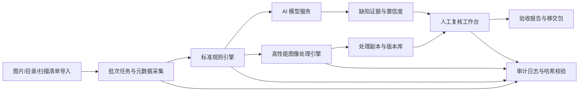

# 扫描图片批量质检修图系统功能设计方案

调研日期：2026-05-07  
设计对象：纸质档案数字化扫描图片的批量质量检查、自动修图、人工复核与验收报告系统。  
目标平台：Windows、macOS、Linux、统信 UOS、银河麒麟、openKylin 等国产化环境，优先保证 Linux x86_64、aarch64、LoongArch 可落地。  

## 1. 设计结论

本系统应采用“标准规则引擎 + 高性能图像处理 + 可选 AI 模型服务 + 人工复核工作台”的架构。核心判断是：国家档案数字化规范中很多要求是可规则化、可 100% 自动检查的，例如文件可打开性、格式、DPI、色彩模式、命名唯一性、页数一致性、漏扫/重扫/多扫、排列顺序、图像完整性、裁边边距、处理后版本留痕等；但“清晰识别”“视觉上基本不偏斜”“展现档案原貌”“不得去除原有褪变斑点、水渍、污点、装订孔”等要求带有业务判断，必须通过阈值校准、模型辅助和人工复核闭环来实现。

推荐的实现策略：

1. 原图永不覆盖。所有修图输出作为“处理副本”，保留原图、处理参数、规则版本、模型版本、操作人和哈希。
2. 第一优先级做 100% 自动验收检查，满足 DA/T 31-2017 对可计算机检验项目 100% 检验的要求。
3. 自动修图只处理扫描过程引入的问题，例如方向错误、轻微倾斜、黑边、扫描污点、扫描线、页面外噪点；不得自动删除可能属于档案原貌的水渍、虫蛀、装订孔、历史污点、手写批注、印章痕迹。
4. AI 模型用于提升疑难识别能力，而不是替代验收结论。模型输出应落到“建议、置信度、证据区域、复核状态”。
5. 性能上采用分层流水线：元数据快速检查、轻量 CV 规则、修图输出、OCR/模型深检分阶段执行。推荐配置以 16 核 CPU、64GB 内存、8GB 至 12GB 显存、NVMe SSD 作为最佳平衡点。

## 2. 标准依据与设计映射

### 2.1 核心标准

| 标准或规范 | 与本系统相关的要求 | 系统设计映射 |
| --- | --- | --- |
| DA/T 31-2017《纸质档案数字化规范》 | 扫描应清晰、完整、不失真，接近档案原貌；彩色模式优先；分辨率不小于 200dpi，小字密集或清晰度差建议不小于 300dpi；长期保存格式可采用 TIFF、JPEG、JPEG2000；同批格式一致；以档号为基础命名且唯一；可进行拼接、旋转纠偏、裁边、去污；不完整、无法清晰识别或失真较大应重新扫描；漏扫、重扫、多扫应及时改正；排列顺序错误应调整；自动检验项目 100% 检验，人工抽检比例不低于 5%。 | 建立标准规则模板、批次参数校验、命名检查、页数/顺序/去重检查、图像完整性检查、纠偏/裁边/去污处理、验收报告和抽检任务生成。 |
| GB/T 20530-2006《文献档案资料数字化工作导则》 | 规定文献档案资料数字化过程、技术选择、成果管理和测试指标。 | 作为项目流程、成果管理、测试指标和质量报告框架的上位依据。 |
| GB/T 18894-2016《电子文件归档与电子档案管理规范》 | 强调真实性、可靠性、完整性与可用性；业务系统应具备纸质档案数字化及数字副本管理功能；电子档案管理系统应有安全保障设施和全过程监控。 | 设计原图/副本版本链、元数据、哈希校验、权限、审计、归档接口和安全部署。 |
| GB/T 44435-2024《信息与文献 数字文件（档案）转换和迁移过程》 | 面向数字文件转换和迁移，目标是保持真实性、可靠性、完整性和可用性。 | 当系统输出 JPEG2000、PDF/A、OFD、缩略图、利用副本或迁移包时，记录转换方案、过程元数据、验证结果。 |
| 《档案数字化外包安全管理规范》及 DA/T 68.2-2020 | 要求数字化外包全过程安全管理，覆盖人员、场所、设备、网络、数据载体、成果移交等。 | 支持本地化、离线化、权限隔离、操作审计、介质交接清单、病毒扫描和设备环境登记。 |

### 2.2 标准中的硬性规则

以下项目应默认进入系统内置规则，并允许按项目方案微调：

| 检查项 | 默认规则 | 不合格处理 |
| --- | --- | --- |
| 文件可打开性 | 每个图片文件或多页文件的每页均可解码。 | 标记 P0，重新导出或重新扫描。 |
| 分辨率 | 不低于 200dpi；小字、密集、低清晰度、COM 输出建议不低于 300dpi；仿真复制可按 600dpi 配置。 | P0/P1，按项目要求返扫或进入人工确认。 |
| 色彩模式 | 同批次一致；默认彩色优先；红头、印章、照片、彩色插图、多色文字必须彩色。 | 标记色彩风险，必要时返扫。 |
| 格式 | 长期保存副本支持 TIFF、JPEG、JPEG2000；同批次格式一致；利用副本可输出 PDF/OFD/PDF/A。 | 格式转换或返工。 |
| 命名唯一性 | 以档号和流水号组合命名，批内唯一，可回溯目录条目。 | 自动列出冲突，禁止验收通过。 |
| 页数一致性 | 目录记录、扫描清单、实际图片数量一致。 | 漏扫、重扫、多扫列表，人工处理。 |
| 排列顺序 | 文件序号、目录页序、OCR 页码或人工页码校验一致。 | 自动排序建议，人工确认后调整。 |
| 裁边 | 如裁边，应在页边最外延外保留 2mm 至 3mm，对应像素按 DPI 换算。 | 自动重裁或人工复核。 |
| 去污边界 | 仅去除扫描产生的污点、污线、黑边等，不去除纸张原有痕迹。 | 低置信度区域不自动处理，进入复核。 |
| 验收比例 | 可自动检验项目 100% 检验；不能自动检验的项目人工抽检不低于 5%。 | 自动生成抽检清单和验收报告。 |

## 3. 功能范围

### 3.1 项目与批次管理

- 创建数字化项目，配置适用标准、扫描对象、档号规则、目录字段、质量阈值、输出格式、验收规则、抽检比例。
- 支持按全宗、目录、案卷、件、批次导入任务。
- 支持导入目录数据：CSV、XLSX、XML、JSON、数据库视图或归档系统接口。
- 支持导入扫描清单和交接清单，记录实体档案出库、扫描、处理、质检、返工、移交状态。
- 支持多套规则模板：普通文书档案、含印章文书、照片插页、图纸、古籍/珍贵档案、低质原件、COM/出版用途。

### 3.2 图片导入与元数据采集

- 支持 TIFF、JPEG、JPEG2000、PNG、BMP、PDF 内嵌图像、OFD 转入插件。
- 读取宽高、DPI、位深、色彩空间、压缩方式、页数、文件大小、EXIF/XMP/TIFF tag、ICC profile、创建时间。
- 计算 SHA-256、感知哈希、页面缩略图、内容框、页面框、黑边框。
- 识别单页文件和多页文件，建议优先按 DA/T 31-2017 采用单页文件。
- 对超大图像采用流式读取和分块处理，避免一次性读入全图导致内存峰值过高。

### 3.3 批量质量检查

质量检查分为四层。

第一层是文件与批次一致性检查：

- 文件是否损坏、能否打开。
- 同批格式、DPI、色彩模式是否一致。
- 文件命名是否符合档号和流水号规则。
- 文件路径是否能与目录数据准确挂接。
- 实际图像数量是否与目录、扫描清单一致。
- 是否存在重复文件、重复页面、多扫、漏扫。

第二层是图像技术质量检查：

- 清晰度：拉普拉斯方差、边缘能量、文本区域局部清晰度。
- 对比度和曝光：直方图分布、动态范围、过曝/欠曝比例。
- 噪声和污点：孤立点、扫描线、黑边、背景异常块。
- 倾斜和方向：90 度方向、180 度倒置、小角度偏斜。
- 完整性：页面内容框是否被裁掉，是否存在大面积缺页、遮挡、截断。
- 变形：透视变形、弯曲、拼接缝、局部拉伸。
- 空白页：空白页识别和登记，不自动删除。

第三层是档案业务质量检查：

- OCR 页码和文件序号是否大致连续。
- 印章、红头、照片、彩色插图页面是否错误转为灰度或二值。
- 档号、页号、正文、签章、附件区域是否被裁边或去污误伤。
- 分幅扫描后的拼接是否完整，拼接处是否有明显断裂或重影。
- 目录条目与图像内容是否可能错挂。该项只能辅助提示，最终仍需人工抽检或复核。

第四层是 AI 辅助深检：

- OCR 置信度低、文字区域异常、版面方向异常、疑似缺页、疑似错挂、疑似非档案页。
- 利用文档版面模型识别正文、标题、印章、表格、图片、页码、装订孔等区域。
- 对复杂页面生成缺陷热力图和复核建议。
- 对抽检样本给出“通过、建议重扫、建议重处理、需人工判定”的建议，不直接作为验收结论。

### 3.4 自动修图处理

自动修图必须按“先生成处理方案，再执行，再复核”的方式进行。默认支持：

- 方向修正：按 OCR 方向、文本方向、页面边界方向判断 90/180/270 度旋转。
- 小角度纠偏：基于文本行、页面边缘或 Hough 线检测，默认仅处理置信度高且角度较小的倾斜。
- 页面裁边：去除黑边和扫描台背景，同时按 DPI 保留 2mm 至 3mm 外延边距。
- 去黑边：识别页面外黑边、双页中缝黑区、扫描仪边框。
- 去扫描污点：清除扫描产生的孤立污点、灰尘、横竖扫描线。
- 背景均衡：轻量校正扫描光照不均，默认不做强二值化。
- 分幅拼接：对有重叠区域的分幅扫描自动配准和拼接，输出拼接质量评分。
- 双页拆分：对书籍式双页图像拆分为单页，保留拆分参数和原图关系。
- 利用副本生成：输出缩略图、预览图、PDF/A 或 OFD 利用副本。

以下处理默认进入人工确认或禁用自动执行：

- 大角度透视校正、弯曲页面展平、强二值化、超分辨率、生成式修复、内容补全。
- 水渍、纸张褪变斑点、虫蛀、装订孔、历史污点、批注、印章周边污痕等疑似原貌区域的处理。
- 任何会改变正文、签章、页号、档号、表格线、手写笔迹的操作。

### 3.5 人工复核工作台

- 原图和处理副本并排查看，支持同步缩放、差异高亮、缺陷框叠加、处理参数查看。
- 按 P0/P1/P2 缺陷、档号、批次、处理类型、模型置信度筛选复核队列。
- 支持一键通过、退回重扫、退回重处理、手动旋转、手动裁边、手动标注缺陷。
- 支持保留“不处理原貌痕迹”的判定记录，防止后续批处理误删。
- 支持复核意见、责任人、时间、规则版本和处理版本留痕。
- 支持人工抽检任务生成，抽检比例默认不低于 5%，可对高风险批次自动提高抽检比例。

### 3.6 验收报告与成果移交

系统应自动生成：

- 批次质检报告：总数、通过数、问题数、返工数、自动修图数、人工复核数。
- 标准符合性报告：逐条映射 DA/T 31-2017 的扫描、处理、挂接、验收要求。
- 缺陷明细表：档号、文件名、页号、问题类型、严重级别、证据图、处理建议。
- 自动修图报告：处理前后指标、处理参数、版本号、操作者。
- 抽检清单和抽检结论：抽检比例、抽检对象、人工结论、合格率。
- 移交包清单：原图、处理副本、目录数据、元数据、日志、校验和、报告。

报告格式建议支持 HTML、PDF、CSV、XLSX、JSON。机器接口输出应包含稳定字段，便于归档系统接入。

## 4. 质量规则设计

### 4.1 严重级别

| 级别 | 含义 | 示例 | 处理方式 |
| --- | --- | --- | --- |
| P0 | 不允许验收通过 | 文件损坏、漏扫、重扫、多扫、无法清晰识别、图像不完整、严重失真、目录挂接错误。 | 必须返扫、返工或人工确认后关闭。 |
| P1 | 可自动修复或人工修复 | 方向错误、轻微倾斜、黑边、扫描污点、裁边不足、顺序疑似错误。 | 自动生成处理方案，复核后通过。 |
| P2 | 风险提示 | OCR 置信度偏低、对比度偏低、疑似色彩模式不当、疑似拼接痕迹。 | 抽检或人工确认。 |
| P3 | 信息提示 | 文件偏大、压缩率异常、DPI 高于项目要求、存在 ICC profile 差异。 | 记录，不阻断验收。 |

### 4.2 默认阈值策略

国家标准对清晰度、偏斜、对比度等没有给出统一量化阈值。系统不应把经验阈值伪装成国家标准，而应采用“标准硬规则 + 项目阈值 + 样本校准”的方式。

建议默认阈值：

- 倾斜角：小于等于 0.5 度通过；0.5 至 1.0 度预警；大于 1.0 度建议纠偏或复核。
- 裁边保留：按 DPI 换算 2mm 至 3mm 像素外延，低于 2mm 预警，裁到正文/页号/印章直接 P0。
- 清晰度：以每批 100 至 300 张人工确认合格样本建立基线，低于基线分位数阈值时预警。
- OCR 置信度：正文印刷件平均置信度低于 0.85 预警，低于 0.75 建议复核；手写件、古籍、低质原件使用单独模板。
- BRISQUE：仅作为无参考图像质量参考，OpenCV 中分数 0 表示最好、100 表示最差；档案扫描件需用本地样本重新校准，不直接采用自然图像默认模型阈值。
- 重复检测：SHA-256 相同直接判重；感知哈希距离低于项目阈值时标记疑似重扫/多扫。

## 5. 开源项目利用方案

| 能力 | 候选项目 | 使用方式 | 注意事项 |
| --- | --- | --- | --- |
| 高性能图像 IO 和批处理 | libvips | 作为大图读写、格式转换、缩略图、裁剪、压缩、流水式处理核心库。 | LGPL-2.1-or-later，适合工程集成；对不可信图片禁用 ImageMagick loader，降低攻击面。 |
| 传统计算机视觉 | OpenCV / OpenCV contrib | 倾斜检测、边缘检测、污点检测、轮廓、Hough、BRISQUE、SSIM/PSNR、图像增强。 | Apache 2.0；BRISQUE 等需要按档案场景校准。 |
| 扫描页后处理算法参考 | unpaper | 参考去黑边、去噪、自动居中、deskew 流程，也可作为外部命令插件。 | GPL 类许可需做合规评估，不建议直接链接进闭源核心。 |
| 扫描页交互式修图参考 | ScanTailor Advanced | 参考页面拆分、纠偏、边框、内容框、批处理、人工校正交互设计。 | GPL-3.0，适合作为流程和算法参考或外部工具，不宜直接嵌入闭源商业产品。 |
| OCR 和版面分析 | PaddleOCR | 中文 OCR、版面检测、文字方向、文档预处理、表格/印章等扩展能力。 | Apache 2.0；GPU/国产 AI 硬件适配需按 Paddle/Paddle Inference 实测。 |
| 传统 OCR | Tesseract | 作为轻量 OCR 后备，适用于印刷体、离线部署、PDF OCR。 | Apache 2.0；中文复杂档案准确率通常不如专用中文 OCR。 |
| PDF OCR 和 PDF/A 输出 | OCRmyPDF | 对 PDF 输入输出 OCR 层、deskew、PDF/A 生成可作为参考或插件。 | MPL-2.0；更多用于 PDF 工作流，图片批处理核心仍建议自研。 |
| 模型推理抽象 | ONNX Runtime | AI 模型统一推理接口，支持 CPU、CUDA、TensorRT、OpenVINO、CANN 等执行提供方。 | 对国产 NPU/GPU 的成熟度需按具体硬件验证，提供 CPU fallback。 |

## 6. AI 模型能力设计

### 6.1 模型任务

优先实现轻量、可解释、可批处理的模型能力：

- 页面方向分类：0/90/180/270 度。
- 文本行方向和阅读方向识别。
- 文档版面区域检测：正文、标题、表格、印章、照片、页码、装订孔、空白边。
- 图像缺陷分类：模糊、过曝、欠曝、黑边、扫描线、污点、裁切、遮挡、透视、拼接痕迹。
- OCR 可读性评分：OCR 置信度、文字区域覆盖率、低置信文本块位置。
- 错挂辅助：目录题名、页内标题、责任者、日期、档号之间的一致性检查。
- 抽检辅助：对人工抽检页面生成缺陷候选，不生成最终结论。

暂不建议第一期使用生成式图像修复模型处理正式归档副本。生成式修复可以用于展示副本或临时预览，但必须标记为 AI 生成/修复，不得替代档案数字化成果。

### 6.2 模型闭环

- 建立质检样本库：合格样本、缺陷样本、返工样本、人工复核样本。
- 每条样本保存来源档号、文件哈希、缺陷标签、标注人、标注时间、规则版本、模型版本。
- 模型输出必须包含置信度、证据区域和可复核截图。
- 支持主动学习：低置信度、规则和模型冲突、人工修改频繁的样本优先进入标注队列。
- 支持模型灰度：同批数据可对比旧模型和新模型，不直接替换生产阈值。

## 7. 系统架构

### 7.1 总体架构

### 7.2 推荐技术栈

为兼顾跨平台、国产化和性能，建议采用三层实现：

1. 控制面服务：Go 或 Java 17。负责项目、批次、任务队列、接口、权限、报告、审计。Go 的优势是单二进制和跨平台部署；Java 的优势是政务系统生态成熟。
2. 图像处理 Worker：C++20 + libvips + OpenCV。负责高性能图片 IO、质检指标计算、自动修图和格式转换。通过 CLI/gRPC 被控制面调用。
3. AI 模型服务：Python + PaddleOCR/ONNX Runtime，或 C++ ONNX Runtime。作为可选 sidecar 部署，按硬件加载 CPU、CUDA、TensorRT、OpenVINO、CANN 等后端。

UI 建议采用 Web 工作台，控制面直接提供静态前端和 REST API。这样在国产桌面系统上只依赖浏览器，不强依赖 Electron。需要离线单机版时，可封装为本地服务 + 浏览器壳。

### 7.3 数据存储

- 单机版：SQLite + 本地文件目录。
- 服务器版：PostgreSQL + 本地 NAS/分布式文件系统/对象存储。
- 任务队列：单机可用嵌入式队列；服务器版可用 Redis、NATS 或 RabbitMQ。
- 报告分析：CSV/XLSX/JSON，同时可导出 Parquet 供后续统计。
- 原图、处理副本、缩略图、证据图分目录存储，所有文件记录 SHA-256。

### 7.4 部署形态

- 单机工作站：适合小批量或馆内初筛，直接挂载本地磁盘。
- 局域网服务器：适合多扫描工位、多复核人员协同。
- 离线涉密环境：完全离线部署，模型和依赖通过介质导入，禁用公网调用。
- 集群模式：多个 Worker 共享任务队列，按 CPU/GPU 资源分配轻检、修图、AI 深检任务。

## 8. 跨平台与国产化设计

### 8.1 支持矩阵

| 平台 | 支持策略 |
| --- | --- |
| Windows 10/11 | 提供安装包和便携版，支持 CPU 和 NVIDIA GPU。 |
| macOS | 提供开发/演示版本，优先 CPU 和 Apple Silicon。 |
| Linux x86_64 | 主力生产平台，支持 CPU、CUDA、TensorRT、OpenVINO。 |
| Linux aarch64 | 支持飞腾、鲲鹏等 ARM64 平台，核心规则和图像处理 CPU 可运行。 |
| LoongArch64 | 作为国产化适配目标，优先保证 Go/Java 控制面、C++ 图像 Worker、本地 CPU 推理可编译运行。 |
| openKylin/银河麒麟/统信 UOS | 采用原生包或离线包部署，避免依赖公网包管理器。 |

openKylin 官方下载页已列出 AMD64、ARM、LoongArch 和 RISC-V 相关版本，说明国产桌面环境的多架构适配是现实要求。系统实现应避免只支持 x86_64 + CUDA 的单一路线。

### 8.2 国产化约束

- 不依赖云 OCR、云大模型或公网 API。
- 第三方库可离线安装，提供校验和和软件物料清单。
- 模型包、规则包、依赖包可签名和版本锁定。
- 运行时必须有 CPU fallback，GPU/NPU 只作为加速。
- 对国产 GPU/NPU 采用插件式后端，不把业务逻辑绑定到 CUDA。
- 支持内外网隔离和介质导入导出流程。

## 9. 性能与硬件平衡方案

### 9.1 性能分层

系统不应把所有图片都送入 OCR 或大模型。最佳吞吐来自分层流水线：

1. 元数据快检：只读文件头、目录和哈希，速度最高。
2. 轻量图像质检：读取图像并计算清晰度、倾斜、黑边、完整性、重复等指标。
3. 自动修图：只对有问题或项目要求统一处理的图片执行，并避免无变化重写。
4. AI 深检：只对高风险页、抽检页、规则不确定页、需要 OCR 的页执行。
5. 人工复核：只处理 P0/P1 或高风险 P2 页面。

### 9.2 推荐硬件配置

实际吞吐取决于图片尺寸、压缩格式、磁盘、网络、是否写处理副本、是否 OCR。以下是设计目标，需要用 1,000 至 10,000 张代表性样本做现场基准测试确认。

| 档位 | 硬件 | 适用场景 | 目标吞吐 |
| --- | --- | --- | --- |
| 最小可用 | 8 核 CPU，32GB 内存，NVMe SSD，无独显 | 单机质检、少量修图、CPU OCR 低频使用 | 标准质检修图 150 至 400 张/分钟；AI 深检 20 至 60 张/分钟。 |
| 推荐平衡 | 16 核 CPU，64GB 内存，NVMe SSD，8GB 至 12GB 显存 GPU 或国产等效 AI 加速卡 | 大多数档案馆批处理，一台机器兼顾吞吐和成本 | 标准质检修图 600 至 1,200 张/分钟；AI 深检 120 至 300 张/分钟。 |
| 高吞吐 | 32 核以上 CPU，128GB 内存，NVMe RAID 或高速 NAS，24GB 显存 GPU 或多卡 | 大批量项目、多工位协同、夜间批处理 | 标准质检修图 1,500 至 3,000 张/分钟；AI 深检 400 至 800 张/分钟。 |

推荐优先采购“CPU 核数 + NVMe IO + 足够内存”，GPU 主要服务 OCR、版面模型和深检。纯规则质检和传统修图并不总是 GPU 受益，很多时候瓶颈是图片解码、TIFF 压缩和磁盘 IO。

### 9.3 性能优化策略

- 使用 libvips 的流式、分块和多线程能力处理大图。
- 对 TIFF/JPEG2000 解码建立独立 IO 线程池，避免 Worker 被磁盘阻塞。
- 先读取文件头和元数据，只有需要图像指标时才解码全图。
- 对相同哈希文件复用检测结果。
- 对无需修图的图片不重写输出文件。
- GPU 模型采用 batch 推理，按显存自动调整 batch size。
- CPU Worker 和 GPU Worker 分队列，避免轻量任务被深检任务阻塞。
- 对网络存储先做本地热缓存，批次完成后再回写。
- 全链路记录每分钟处理图片数、平均耗时、P95 耗时、CPU/GPU/内存/IO 使用率。

## 10. 安全与合规

- 原图、处理副本和报告均记录 SHA-256，移交时生成校验清单。
- 角色权限：项目管理员、扫描员、修图员、质检员、复核员、验收员、审计员。
- 操作审计：导入、处理、复核、删除、导出、规则变更、模型变更全部留痕。
- 数据隔离：按项目、密级、全宗或部门隔离存储和权限。
- 离线部署：支持无互联网运行，禁用外部模型调用。
- 病毒扫描：对导入介质、输出载体、移交包进行病毒检查记录。
- 安全删除：临时文件、缓存、缩略图按策略清理，涉密环境按单位制度执行。
- 软件供应链：第三方库、模型、规则模板生成 SBOM，记录许可证、版本和来源。

## 11. 验收指标

第一期产品验收建议采用以下指标：

- 标准规则覆盖：DA/T 31-2017 中可计算机检查项目覆盖率达到 100%。
- 自动检查执行率：批内所有图片均完成文件、格式、命名、DPI、色彩、数量、顺序、完整性、重复、基本质量检查。
- 自动修图安全性：原图不覆盖，处理副本可回溯，参数可复现。
- 人工抽检：系统自动生成不低于 5% 的抽检任务，高风险批次可提升至 10% 至 20%。
- 缺陷闭环：P0/P1 问题必须有处理结论才能进入验收通过状态。
- 性能指标：推荐配置下标准质检修图达到 600 张/分钟以上；AI 深检达到 120 张/分钟以上。
- 报告完整性：可导出批次报告、缺陷明细、处理日志、抽检清单、移交校验清单。
- 跨平台：至少完成 Linux x86_64、Linux aarch64、Windows 的构建和回归测试；国产化项目再加入 LoongArch/openKylin/银河麒麟/UOS 适配测试。

## 12. 分阶段实施计划

### 阶段一：标准规则和批处理骨架

- 项目、批次、目录导入、图片导入。
- 文件可打开性、格式、DPI、色彩模式、命名、路径、数量、重复、顺序基础检查。
- 缩略图、证据图、缺陷列表、HTML/CSV/XLSX 报告。
- 原图哈希、版本记录、审计日志。

### 阶段二：自动修图和复核工作台

- 方向修正、轻微纠偏、裁边、黑边去除、扫描污点处理。
- 原图/处理副本对比查看。
- P0/P1/P2 队列、人工确认、返工闭环。
- 抽检任务生成和验收报告。

### 阶段三：OCR 与模型辅助

- PaddleOCR/Tesseract 接入。
- OCR 置信度、页码连续性、方向识别、正文可读性评分。
- 版面区域检测、印章/照片/表格区域识别。
- 缺陷模型和人工标注闭环。

### 阶段四：国产化与规模化

- Linux x86_64/aarch64/LoongArch 构建。
- UOS、银河麒麟、openKylin 适配包。
- GPU/NPU 后端插件，支持 CPU fallback。
- 多 Worker 集群、任务调度、性能压测和监控。
- 与电子档案管理系统、目录数据库、移交包规范对接。

## 13. 关键风险

- 标准量化不足：清晰度、偏斜、原貌痕迹等要求需要项目样本校准和专家确认，不能只靠固定阈值。
- 自动去污风险：误删档案原貌痕迹是高风险，默认必须保守。
- GPL 许可证风险：unpaper、ScanTailor Advanced 适合参考或外部工具，若嵌入商业闭源产品需专项合规评审。
- 国产 AI 硬件差异：ONNX/Paddle 在不同国产 GPU/NPU 上成熟度不同，必须保留 CPU 路线并做实机压测。
- IO 瓶颈：大批量 TIFF/JPEG2000 处理常受磁盘和 NAS 限制，硬件方案必须包含 NVMe 热缓存和网络带宽评估。
- OCR 幻觉式使用：OCR 和模型只能辅助判断，不应自动做档案业务结论。

## 14. 资料来源

- DA/T 31-2017《纸质档案数字化规范》：https://www.dajs.gov.cn/art/2021/9/3/art_59_40827.html
- DA/T 31-2017 PDF 公共副本：https://lib.gzmtu.edu.cn/__local/9/FA/C2/F5F1C79514027B5C655DFF72029_94C8A66B_3B938.pdf
- GB/T 20530-2006《文献档案资料数字化工作导则》全国标准信息公共服务平台：https://openstd.samr.gov.cn/bzgk/std/newGbInfo?hcno=5A1F16EBEE8F1008223A690BB5309A31
- GB/T 18894-2016《电子文件归档与电子档案管理规范》全国标准信息公共服务平台：https://openstd.samr.gov.cn/bzgk/std/newGbInfo?hcno=EB1CC0500D91490B5D219823AC1F3D16
- GB/T 18894-2016 公共文本页：https://www.nbdaj.gov.cn/art/2020/7/2/art_1229826583_23878.html
- GB/T 44435-2024《信息与文献 数字文件（档案）转换和迁移过程》全国标准信息公共服务平台：https://openstd.samr.gov.cn/bzgk/std/newGbInfo?hcno=F6BD8CBBEC6CA1603CC75FB8A83A0616
- 国家档案局《档案数字化外包安全管理规范》解读：https://www.saac.gov.cn/daj/yaow/201502/bf7630719db64cad85e1ede7be8e2338.shtml
- DA/T 68.2-2020《档案服务外包工作规范 第2部分：档案数字化服务》：https://hbda.gov.cn/info/3471
- libvips：https://github.com/libvips/libvips
- OpenCV：https://opencv.org/about/
- OpenCV QualityBRISQUE：https://docs.opencv.org/4.x/d8/d99/classcv_1_1quality_1_1QualityBRISQUE.html
- unpaper：https://github.com/unpaper/unpaper
- ScanTailor Advanced：https://github.com/4lex4/scantailor-advanced
- PaddleOCR：https://www.paddleocr.ai/main/en/index/index.html
- Tesseract OCR：https://github.com/tesseract-ocr/tesseract
- OCRmyPDF：https://github.com/ocrmypdf/OCRmyPDF
- ONNX Runtime Execution Providers：https://onnxruntime.ai/docs/execution-providers/
- openKylin 项目：https://openatom.cn/project/0EhCUaxn4V6B
- openKylin 下载与架构支持：https://www.openkylin.top/downloads/
