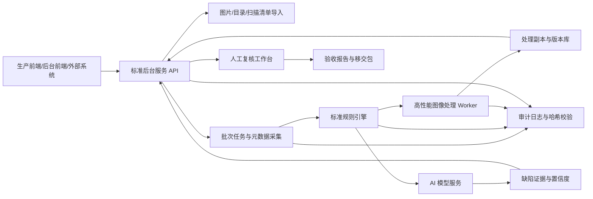

# 扫描图片批量质检修图系统功能设计方案

调研日期：2026-05-07  
设计对象：纸质档案数字化扫描图片的批量质量检查、自动修图、人工复核与验收报告系统。  
目标平台：当前生产目标以 Windows 本地和 Windows 可控服务环境为主，必须完美支持中文文件名、中文目录名和包含空格/全角字符的路径；先完成本地单机生产能力和可被外部程序稳定调用的服务型 CLI/后台能力，局域网集中处理场景放到本地能力成熟后实现；统信 UOS、银河麒麟、openKylin、aarch64、LoongArch 等国产化适配暂时搁置，待明确通知后再启动。

## 1. 设计结论

本系统应采用“标准后台服务 + 标准规则引擎 + 高性能图像处理 + 可选 AI 模型服务 + 人工复核工作台”的架构。核心判断是：国家档案数字化规范中很多要求是可规则化、可 100% 自动检查的，例如文件可打开性、格式、DPI、色彩模式、命名唯一性、页数一致性、漏扫/重扫/多扫、排列顺序、图像完整性、裁边边距、处理后版本留痕等；但“清晰识别”“视觉上基本不偏斜”“展现档案原貌”“不得去除原有褪变斑点、水渍、污点、装订孔”等要求带有业务判断，必须通过阈值校准、模型辅助和人工复核闭环来实现。

产品方向必须锁定为“生产工人批量质检修图工作台”，而不是统计优先的管理驾驶舱。普通生产用户通常是扫描处理工人，计算机经验有限；主入口必须是中文、图片导向、动作导向的本地工作台，围绕“选择扫描图片文件夹、选择处理后图片输出文件夹、开始批量质检和安全自动修图、只复核少量需要人工判断的图片、完成导出”组织。现有聚合摘要、验证摘要、证据包、交接摘要仍然重要，但它们属于后台、管理员、验收或维护入口，不得成为普通生产工人的第一屏或主要工作流。

架构目标必须补充为“前后端完全解耦”。后端作为标准后台服务对外提供稳定服务接口，负责项目、批次、任务调度、文件访问授权、质检规则、图像处理、复核记录、验收摘要、审计和性能优化；前端只通过服务接口读取状态、提交操作和展示预览，不直接承担图像处理、任务调度或性能关键逻辑。该服务接口应可被生产工作台、后台管理界面、验收工具、归档系统或其他外部系统调用，接口契约、鉴权、幂等性、任务状态和隐私过滤都必须作为产品能力维护。

近期交付目标补充为“CLI 稳定批量服务版”。在标准后台服务尚未完成前，`archive-scan-qc` CLI 可以作为外部调度系统、本地脚本、自动化验收工具和生产运维流程调用的稳定批处理入口。该版本不是长期前端集成方式，也不替代后续 REST/gRPC 服务；它的目标是先把现有批量质检修图能力封装成可安装、可复跑、可观测、可恢复、输出契约稳定的命令行程序，让外部系统能够以进程调用方式提交图片批次、读取状态文件、获取聚合报告和处理副本。

实际生产拓扑的长期目标是局域网内多台低配置扫描电脑直接产生原始扫描图片，一台服务器集中监控指定文件夹、备份原始文件、执行质检和安全修图，并保存处理后图片。该局域网集中处理能力放到本地单机生产能力完善后再实现，不作为当前优先任务。国产化适配、OS-specific packaging、UOS/麒麟/openKylin、aarch64、LoongArch 实机适配继续暂停，待单独通知后再启动。

推荐的实现策略：

1. 原图永不覆盖。所有修图输出作为“处理副本”，保留原图、处理参数、规则版本、模型版本、操作人和哈希。
2. 第一优先级做 100% 自动验收检查，满足 DA/T 31-2017 对可计算机检验项目 100% 检验的要求。
3. 自动修图只处理扫描过程引入的问题，例如方向错误、轻微倾斜、黑边、扫描污点、扫描线、页面外噪点；不得自动删除可能属于档案原貌的水渍、虫蛀、装订孔、历史污点、手写批注、印章痕迹。
4. AI 模型用于提升疑难识别能力，而不是替代验收结论。模型输出应落到“建议、置信度、证据区域、复核状态”。
5. 性能上采用分层流水线：元数据快速检查、轻量 CV 规则、修图输出、OCR/模型深检分阶段执行。必须充分利用可用软硬件提高图片处理质量和效率，对 GPU+模型、CPU 向量化、OpenCV/NumPy、libvips 流式处理等方案做可测对比，只采用在质量或性能上有明确优势且能保守回退的方案。
6. 对外能力通过标准后台服务接口提供。前端、外部归档系统和自动化验收工具都不直接调用内部 Worker 或临时脚本；它们通过 REST/gRPC 等稳定接口提交任务、查询进度、读取预览、提交复核动作和获取聚合摘要。
7. 本地单机工具首版不设置产品登录流程，符合新增需求中“工具系统不需要登录功能”的定位；安全边界由本机目录授权、操作系统权限、任务审计和离线部署承担。局域网集中版或多角色后台入口如需权限控制，应放在标准后台服务边界扩展，不反向增加普通生产入口负担。
8. 新增生产需求按“核心质检修图 + 生产辅助工具”分层纳入，不改变原方案主体。JPG 批量/单文件质检是首期生产闭环；TIF/JPG/PDF/OFD 转换、批量重命名、DPI 修改、Excel 分件和 OCR 目录生成统一作为后台批量工具任务，复用 dry-run、日志、checkpoint、恢复和隐私过滤规则。
9. CLI 稳定批量服务版作为近期过渡交付。外部系统可调用固定的公开命令和读取固定 JSON/CSV/HTML 产物，但不得依赖内部 Python 模块、临时脚本、未声明字段或私有路径。CLI 输出契约和退出码必须版本化，后续标准后台服务应复用同一批次任务模型、规则模板、处理副本目录和聚合摘要语义。
10. 多线程和多请求并发是核心能力，不是可选优化。系统必须支持同一进程或同一后台服务同时响应多个外部请求；每个请求必须拥有独立的 job_id、batch_id、工作目录、metadata 目录、处理副本目录、日志、checkpoint、临时文件和资源配额，禁止不同请求共享可变状态、混写输出、串用模板参数或互相污染复核队列。
11. Windows 与中文路径兼容必须作为首期验收门槛。所有路径处理必须使用结构化路径 API，保留 Unicode 文件名，避免把路径转为本地代码页、URL 片段或日志字符串后再解析；公开摘要仍要隐藏私有绝对路径和真实文件名，但本地受控日志和处理 manifest 必须能准确记录、恢复和定位中文路径。
12. 源文件绝对安全优先于自动修图收益。默认只读输入目录，所有写操作必须落在明确授权的输出目录或处理副本目录；任何“受控覆盖发布”都必须经过备份、dry-run、冲突检查、显式确认、可回滚日志和源文件哈希复核，且不得作为默认生产模式。

### 1.1 普通生产用户主流程

生产工作台的首版最小闭环必须只要求普通用户理解以下动作：

1. 选择“扫描图片文件夹”：本地原始扫描图所在目录，只读取，不覆盖。
2. 选择“处理后图片输出文件夹”：系统写入处理副本、预览图、日志和可交付成果的位置。
3. 点击“开始处理”：系统自动完成批量质检、方向修正、轻微纠偏、裁边、去黑边、去扫描污点等安全处理。
4. 处理“待复核图片”：只展示需要人工判断的少量图片，提供原图/处理后对比和明确动作按钮。
5. 点击“完成导出”：生成处理后图片和面向验收/后台的摘要，不要求生产工人阅读统计驾驶舱。

普通工作台不应把 P0/P1/P2 统计图、性能曲线、证据包完整性、验证索引、移交包字段作为入口主内容。这些信息可以在管理员入口中查看，也可以作为生产流程完成后的辅助摘要，但不能替代图片和动作。

### 1.2 中文生产词汇

普通用户界面统一使用下列中文词汇，避免暴露过多工程术语：

| 界面词汇 | 含义 | 避免给普通用户显示 |
| --- | --- | --- |
| 扫描图片文件夹 | 原始扫描图片输入目录 | input path、manifest source、source root |
| 处理后图片输出文件夹 | 处理副本和交付成果输出目录 | process_out、derivative root |
| 开始处理 | 启动批量质检和安全自动修图 | run plan、pipeline、worker dispatch |
| 正在检查 | 文件、格式、DPI、命名、完整性等自动检查中 | preflight、rule engine |
| 正在优化图片 | 自动旋转、纠偏、裁边、去黑边、去扫描污点中 | processing stage、retouch backend |
| 待复核图片 | 需要人工判断的图片队列 | review queue、findings |
| 通过 | 当前图片或批次可继续 | accept decision |
| 需要重扫 | 原图质量不足，需要重新扫描 | P0 finding、rescan |
| 重新处理 | 调整处理方式或重新生成处理后图片 | reprocess |
| 保留原貌 | 疑似水渍、装订孔、印章、批注等档案原貌，不自动去除 | protected original mark |
| 完成导出 | 结束批次并生成处理后图片和摘要 | final handoff、acceptance artifact |

### 1.3 CLI 稳定批量服务版目标

在标准后台服务完成前，项目需要先交付一个可通过 CLI 稳定对外调用的批量质检修图程序版本。该版本面向“外部系统或运维脚本调用命令行程序”的集成方式，重点不是增加交互页面，而是把批量处理能力固化为可发布、可安装、可复跑、可诊断的服务型 CLI。

稳定 CLI 版的公开入口应收敛为少量命令：

- `archive-scan-qc production-run`：单批次生产入口，输入原图目录，输出处理副本、质检报告、进度文件、复核队列和生产摘要。
- `archive-scan-qc run-plan`：多批次计划入口，按 CSV/JSON 计划执行多个批次，支持失败批次记录、继续执行和聚合项目摘要。
- `archive-scan-qc preflight`：发布前或运行前的输入、规则和环境预检入口。
- `archive-scan-qc capability-probe`：运行环境能力探测入口，用于确认 Pillow、可选 OpenCV/NumPy/libvips、CPU/线程和模型 sidecar 能力。

对外调用契约必须满足：

- 参数稳定：公开参数的语义、默认值和路径规则版本化；新增参数保持向后兼容，废弃参数先告警后移除。
- 输出稳定：每次运行必须生成机器可读的 JSON 摘要、处理 manifest、错误/重试清单、聚合审计摘要和必要的 HTML/CSV 报告；schema_version 必须随不兼容变更升级。
- 状态稳定：长批次运行必须持续写入进度文件，至少区分 `running`、`needs_review`、`finished`、`failed`、`interrupted`、`blocked`；异常退出后不得长期停留在无法解释的 `running` 状态。
- 恢复稳定：处理副本、manifest、retry manifest 和 checkpoint 支持断点复跑；重复调用不得静默覆盖原图或丢失已完成处理结果。
- 规则稳定：CLI 必须支持与后台服务一致的图像处理规则模板 ID、版本和参数摘要；内置模板和用户自定义模板的校验结果必须写入报告。
- 隐私稳定：对外摘要默认不泄露私有路径、文件名、hash、OCR 文本、缩略图、图片内容和行级证据；本地敏感证据只保存在受控输出目录。
- 运维稳定：退出码、日志、错误码、性能计时和失败重试建议必须可被外部调度器解析；发布包必须在干净环境安装并通过 synthetic smoke、release validation 和核心回归测试。

CLI 稳定版的验收标准是：外部系统只需要准备输入目录、输出目录、规则模板和可选批次计划，就能通过固定命令启动批量质检修图，并通过固定文件读取进度、结果、失败原因和复核待办。任何需要导入内部 Python 函数、解析临时日志、读取未声明字段或人工判断进程是否卡死的集成方式，都不视为稳定对外服务能力。

### 1.4 当前目标对齐与不可变约束

当前产品目标统一为：生成一个高质量、高性能的批量扫描图片质检和修图工具，既能独立运行，也能作为引擎通过简单明了的接口对外提供服务。独立运行形态优先满足本地 Windows 操作员批量处理；服务形态优先满足外部程序、归档系统、验收工具和自动化调度器以 CLI、REST/gRPC 或后续 OpenAPI 契约提交任务、查询状态和获取聚合结果。

以下约束作为后续设计、开发、测试和验收的硬边界：

- 后端是唯一图像处理执行方。前端、外部调用程序和运维脚本只提交任务、选择模板、读取状态、查看授权预览和提交复核动作。
- 后端接口必须简单明确：调用方至少能用输入目录、输出目录、规则模板、可选 workers 和批次标识启动一次处理；不要求理解内部 Python 模块、Worker 队列或图像处理算法细节。
- 并发请求必须强隔离：请求级上下文包含 job_id、batch_id、模板快照、输入授权、输出目录、metadata 目录、临时目录、日志、checkpoint、复核队列和资源限制；任何错误、取消、重试或恢复只影响当前请求。
- 多线程处理必须可控：默认由后端按 CPU、内存、磁盘和图片尺寸自动选择 worker 数；外部请求可传入期望 worker 数，但后台必须按安全上限限流，避免单个请求耗尽资源影响其他请求。
- 中文文件名和路径必须完美支持：Windows 下的中文全宗名、案卷名、文件名、带空格目录、长路径和移动硬盘路径都必须可扫描、处理、恢复和生成报告；公开材料仍按隐私规则脱敏。
- 源文件绝对安全：系统不得在默认模式下修改、移动、删除或覆盖输入文件；处理副本、预览图、报告、日志和临时文件必须与源文件分目录管理。
- 规则模板必须贯穿接口、处理链和报告：调用方选择的模板 ID、版本、参数摘要和校验结果必须写入任务状态、处理 manifest、审计摘要和验收报告。

## 2. 标准依据与设计映射

### 2.1 核心标准

| 标准或规范 | 与本系统相关的要求 | 系统设计映射 |
| --- | --- | --- |
| DA/T 31-2017《纸质档案数字化规范》 | 扫描应清晰、完整、不失真，接近档案原貌；彩色模式优先；分辨率不小于 200dpi，小字密集或清晰度差建议不小于 300dpi；长期保存格式可采用 TIFF、JPEG、JPEG2000；同批格式一致；以档号为基础命名且唯一；可进行拼接、旋转纠偏、裁边、去污；不完整、无法清晰识别或失真较大应重新扫描；漏扫、重扫、多扫应及时改正；排列顺序错误应调整；自动检验项目 100% 检验，人工抽检比例不低于 5%。 | 建立标准规则模板、批次参数校验、命名检查、页数/顺序/去重检查、图像完整性检查、纠偏/裁边/去污处理、验收报告和抽检任务生成。 |
| GB/T 20530-2006《文献档案资料数字化工作导则》 | 规定文献档案资料数字化过程、技术选择、成果管理和测试指标。 | 作为项目流程、成果管理、测试指标和质量报告框架的上位依据。 |
| GB/T 18894-2016《电子文件归档与电子档案管理规范》 | 强调真实性、可靠性、完整性与可用性；业务系统应具备纸质档案数字化及数字副本管理功能；电子档案管理系统应有安全保障设施和全过程监控。 | 设计原图/副本版本链、元数据、哈希校验、权限、审计、归档接口和安全部署。 |
| GB/T 44435-2024《信息与文献 数字文件（档案）转换和迁移过程》 | 面向数字文件转换和迁移，目标是保持真实性、可靠性、完整性和可用性。 | 当系统输出 JPEG2000、PDF/A、OFD、缩略图、利用副本或迁移包时，记录转换方案、过程元数据、验证结果。 |
| 《档案数字化外包安全管理规范》及 DA/T 68.2-2020 | 要求数字化外包全过程安全管理，覆盖人员、场所、设备、网络、数据载体、成果移交等。 | 支持本地化、离线化、权限隔离、操作审计、介质交接清单、病毒扫描和设备环境登记。 |

### 2.2 标准中的硬性规则

以下项目应默认进入系统内置规则，并允许按项目方案微调：

| 检查项 | 默认规则 | 不合格处理 |
| --- | --- | --- |
| 文件可打开性 | 每个图片文件或多页文件的每页均可解码。 | 标记 P0，重新导出或重新扫描。 |
| 分辨率 | 不低于 200dpi；小字、密集、低清晰度、COM 输出建议不低于 300dpi；仿真复制可按 600dpi 配置。 | P0/P1，按项目要求返扫或进入人工确认。 |
| 色彩模式 | 同批次一致；默认彩色优先；红头、印章、照片、彩色插图、多色文字必须彩色。 | 标记色彩风险，必要时返扫。 |
| 格式 | 长期保存副本支持 TIFF、JPEG、JPEG2000；同批次格式一致；利用副本可输出 PDF/OFD/PDF/A。 | 格式转换或返工。 |
| 命名唯一性 | 以档号和流水号组合命名，批内唯一，可回溯目录条目。 | 自动列出冲突，禁止验收通过。 |
| 页数一致性 | 目录记录、扫描清单、实际图片数量一致。 | 漏扫、重扫、多扫列表，人工处理。 |
| 排列顺序 | 文件序号、目录页序、OCR 页码或人工页码校验一致。 | 自动排序建议，人工确认后调整。 |
| 裁边 | 如裁边，应在页边最外延外保留 2mm 至 3mm，对应像素按 DPI 换算。 | 自动重裁或人工复核。 |
| 去污边界 | 仅去除扫描产生的污点、污线、黑边等，不去除纸张原有痕迹。 | 低置信度区域不自动处理，进入复核。 |
| 验收比例 | 可自动检验项目 100% 检验；不能自动检验的项目人工抽检不低于 5%。 | 自动生成抽检清单和验收报告。 |

## 3. 功能范围

### 3.1 项目与批次管理

- 创建数字化项目，配置适用标准、扫描对象、档号规则、目录字段、质量阈值、输出格式、验收规则、抽检比例。
- 支持按全宗、目录、案卷、件、批次导入任务。
- 支持导入目录数据：CSV、XLSX、XML、JSON、数据库视图或归档系统接口。
- 支持导入扫描清单和交接清单，记录实体档案出库、扫描、处理、质检、返工、移交状态。
- 支持多套规则模板：普通文书档案、含印章文书、照片插页、图纸、古籍/珍贵档案、低质原件、COM/出版用途。

### 3.1.1 图像处理规则模板

系统应提供可配置的图像处理规则模板。模板不是简单的前端选项，而是后端服务执行图片处理时的一组稳定参数集合，覆盖质检阈值、自动处理开关、处理强度、保护区域、复核策略、输出格式和验收口径。生产用户选择模板后，后台服务按模板参数生成处理方案、执行图像处理、记录审计字段，并在报告中写明模板名称、版本和参数摘要。

默认提供 3 个内置模板，并支持用户自定义：

| 模板 | 适用场景 | 处理目标 | 后端参数方向 |
| --- | --- | --- | --- |
| DA/T 31-2017 标准模板 | 普通纸质档案数字化、验收交付、需严格保留档案原貌的批次。 | 严格按 DA/T 31-2017 和项目规则执行，原图不覆盖，处理副本可追溯，自动处理只限保守安全项。 | DPI、格式、色彩模式、命名、页序、裁边边距、去污边界、抽检比例、P0/P1/P2 严重级别按标准和项目配置执行；疑似原貌区域默认保护或进复核。 |
| 纯文本高清晰度模板 | 普通打印体、复印件、无明显档案原貌保护诉求、目标是提高阅读和打印观感的文本扫描件。 | 尽量提高图片洁净度和文字清晰度，输出接近干净打印效果。 | 可提高去黑边、去污点、背景均衡、色调归一、扫描线清理、文本增强、边缘锐化等处理强度；该模板可关闭去污点前的照片/混合内容保护判断，调用方必须仅在确认批次为纯文本扫描件时使用；仍不得误伤正文、页码、表格线和签章。 |
| 原貌高保真模板 | 照片、绘画、图纸、印章密集页、珍贵档案、历史痕迹价值高的材料。 | 最大限度保留核心内容和原貌，只处理边框外、扫描台背景、明确黑边等指定区域。 | 核心区域默认禁止清理、增强、去污和锐化；只允许边框外或用户指定区域处理；装订孔、斑点、水渍、笔迹、印章、纹理和色彩变化默认保护并进入人工确认。 |
| 用户自定义模板 | 项目规则、客户偏好、特殊馆藏或特定生产流程。 | 由管理员根据项目目标组合参数。 | 基于内置模板克隆或新建，支持参数校验、样例图预览、dry-run、版本号、审批状态、回滚和导出导入；不得关闭关键 P0 完整性规则或突破隐私/审计边界。 |

每个模板至少应包含以下参数组：

- 质量规则参数：DPI、格式、色彩模式、命名规则、页序/manifest 检查、空白页和重复页策略。
- 图像处理参数：自动裁边、去黑边、纠偏、去扫描污点、背景色处理、扫描线处理、文字增强、锐化、DPI 元数据修正、PDF/OFD 输出策略。
- 区域保护参数：正文、页号、档号、表格线、印章、照片、绘画、装订孔、批注、水渍、纸张纹理、边框外区域的保护/允许处理策略。
- 人工复核参数：哪些处理进入待复核、抽检比例、低置信度阈值、模板风险提示和完成导出阻断规则。
- 性能参数：worker 策略、可选后端、是否启用高耗时处理、是否启用 OCR/模型深检、是否允许只处理候选图片。
- 审计参数：模板 ID、名称、版本、来源、创建人、审批状态、适用批次、参数摘要和变更记录。

### 3.2 图片导入与元数据采集

- 支持 TIFF、JPEG、JPEG2000、PNG、BMP、PDF 内嵌图像、OFD 转入插件。
- 读取宽高、DPI、位深、色彩空间、压缩方式、页数、文件大小、EXIF/XMP/TIFF tag、ICC profile、创建时间。
- 计算 SHA-256、感知哈希、页面缩略图、内容框、页面框、黑边框。
- 识别单页文件和多页文件，建议优先按 DA/T 31-2017 采用单页文件。
- 对超大图像采用流式读取和分块处理，避免一次性读入全图导致内存峰值过高。

### 3.3 批量质量检查

质量检查分为四层。

第一层是文件与批次一致性检查：

- 文件是否损坏、能否打开。
- 同批格式、DPI、色彩模式是否一致。
- 文件命名是否符合档号和流水号规则。
- 文件路径是否能与目录数据准确挂接。
- 实际图像数量是否与目录、扫描清单一致。
- 是否存在重复文件、重复页面、多扫、漏扫。

第二层是图像技术质量检查：

- 清晰度：拉普拉斯方差、边缘能量、文本区域局部清晰度。
- 对比度和曝光：直方图分布、动态范围、过曝/欠曝比例。
- 噪声和污点：孤立点、扫描线、黑边、背景异常块。
- 倾斜和方向：90 度方向、180 度倒置、小角度偏斜。
- 完整性：页面内容框是否被裁掉，是否存在大面积缺页、遮挡、截断。
- 变形：透视变形、弯曲、拼接缝、局部拉伸。
- 空白页：空白页识别和登记，不自动删除。

第三层是档案业务质量检查：

- OCR 页码和文件序号是否大致连续。
- 印章、红头、照片、彩色插图页面是否错误转为灰度或二值。
- 档号、页号、正文、签章、附件区域是否被裁边或去污误伤。
- 分幅扫描后的拼接是否完整，拼接处是否有明显断裂或重影。
- 目录条目与图像内容是否可能错挂。该项只能辅助提示，最终仍需人工抽检或复核。

第四层是 AI 辅助深检：

- OCR 置信度低、文字区域异常、版面方向异常、疑似缺页、疑似错挂、疑似非档案页。
- 利用文档版面模型识别正文、标题、印章、表格、图片、页码、装订孔等区域。
- 对复杂页面生成缺陷热力图和复核建议。
- 对抽检样本给出“通过、建议重扫、建议重处理、需人工判定”的建议，不直接作为验收结论。

### 3.4 自动修图处理

自动修图必须按“先生成处理方案，再执行，再复核”的方式进行。默认支持：

- 方向修正：按 OCR 方向、文本方向、页面边界方向判断 90/180/270 度旋转。
- 小角度纠偏：基于文本行、页面边缘或 Hough 线检测，默认仅处理置信度高且角度较小的倾斜。
- 页面裁边：去除黑边和扫描台背景，同时按 DPI 保留 2mm 至 3mm 外延边距。
- 去黑边：识别页面外黑边、双页中缝黑区、扫描仪边框。
- 去扫描污点：清除扫描产生的孤立污点、灰尘、横竖扫描线。
- 背景均衡：轻量校正扫描光照不均，默认不做强二值化。
- 分幅拼接：对有重叠区域的分幅扫描自动配准和拼接，输出拼接质量评分。
- 双页拆分：对书籍式双页图像拆分为单页，保留拆分参数和原图关系。
- 利用副本生成：输出缩略图、预览图、PDF/A 或 OFD 利用副本。

以下处理默认进入人工确认或禁用自动执行：

- 大角度透视校正、弯曲页面展平、强二值化、超分辨率、生成式修复、内容补全。
- 水渍、纸张褪变斑点、虫蛀、装订孔、历史污点、批注、印章周边污痕等疑似原貌区域的处理。
- 任何会改变正文、签章、页号、档号、表格线、手写笔迹的操作。

### 3.5 人工复核工作台

- 原图和处理副本并排查看，支持同步缩放、差异高亮、缺陷框叠加、处理参数查看。
- 按 P0/P1/P2 缺陷、档号、批次、处理类型、模型置信度筛选复核队列。
- 支持一键通过、退回重扫、退回重处理、手动旋转、手动裁边、手动标注缺陷。
- 支持保留“不处理原貌痕迹”的判定记录，防止后续批处理误删。
- 支持复核意见、责任人、时间、规则版本和处理版本留痕。
- 支持人工抽检任务生成，抽检比例默认不低于 5%，可对高风险批次自动提高抽检比例。

生产复核工作台必须服务于“少量例外处理”，不是让普通工人浏览全量缺陷统计。默认队列只显示系统无法安全自动决定的图片；已经自动通过或安全处理的图片应保持可追溯，但不进入普通用户的待办队列。

### 3.5.1 本地生产工作台最小契约

后续生产 UI、local runner、图片复核队列和性能对比任务必须共享以下最小契约。字段名是建议的稳定机器字段；中文标签按 1.2 节展示。

#### 批次设置状态

```json
{
  "schema_version": "scan-qc.production-workbench.v1",
  "batch_id": "batch-20260512-001",
  "input_mode": "folder|single_file",
  "input_folder": "/local/private/source",
  "input_file": "/local/private/source/page-0001.jpg",
  "output_folder": "/local/private/output",
  "rules_profile": "production-default",
  "selected_processing": ["trim_dark_border", "binding_hole_review", "deskew", "background_balance"],
  "output_mode": "copy_only|controlled_publish",
  "thread_count": "auto|1|2|4|8",
  "login_required": false,
  "status": "not_started|ready|running|paused|needs_review|exporting|finished|blocked",
  "operator_id": "local-user",
  "created_at": "2026-05-12T09:00:00+08:00"
}
```

生产 UI 可以显示本地文件夹路径给当前机器操作员，但不得把这些路径写入可外传的公开摘要、GitHub、Linear 或聚合验收材料。

#### 进度事件

进度以追加事件流或可轮询快照表达，至少覆盖：

```json
{
  "event_id": "evt-000001",
  "batch_id": "batch-20260512-001",
  "stage": "checking|optimizing|review_waiting|exporting|finished|blocked",
  "message_zh": "正在优化图片",
  "processed_count": 120,
  "total_count": 300,
  "auto_fixed_count": 42,
  "review_required_count": 3,
  "blocked_count": 0,
  "occurred_at": "2026-05-12T09:03:00+08:00"
}
```

普通工作台只需要展示中文阶段、进度条、已处理数量、待复核数量和阻断原因；性能吞吐、规则命中分布和后端计时进入管理员入口。

#### 复核队列项

```json
{
  "review_item_id": "rev-0001",
  "batch_id": "batch-20260512-001",
  "display_name": "第 0012 张",
  "severity": "needs_rescan|needs_decision|warning",
  "reason_zh": "疑似裁到正文，需要人工确认",
  "original_preview_url": "local-preview://original/rev-0001",
  "processed_preview_url": "local-preview://processed/rev-0001",
  "evidence_regions": [
    {"x": 120, "y": 80, "width": 300, "height": 60, "label_zh": "疑似裁切"}
  ],
  "suggested_action": "pass|rescan|reprocess|keep_original_mark",
  "allowed_actions": ["pass", "rescan", "reprocess", "keep_original_mark"]
}
```

复核项面向图片和动作，不默认展示私有文件名、绝对路径、哈希、OCR 文本或完整规则对象。需要管理员追溯时，通过后台受控入口查看。

#### 操作员动作

```json
{
  "action_id": "act-0001",
  "review_item_id": "rev-0001",
  "action": "pass|rescan|reprocess|keep_original_mark|pause_batch|resume_batch|finish_export",
  "note_zh": "保留装订孔，属于档案原貌",
  "operator_id": "local-user",
  "created_at": "2026-05-12T09:05:00+08:00"
}
```

生产入口只提供明确动作按钮：通过、需要重扫、重新处理、保留原貌、暂停、继续、完成导出。批量删除、规则调参、模型切换、证据包编辑、阈值编辑不属于普通生产入口。

#### 输出结果摘要

```json
{
  "batch_id": "batch-20260512-001",
  "status": "finished|blocked",
  "input_count": 300,
  "processed_output_count": 297,
  "rescan_required_count": 3,
  "auto_fixed_count": 80,
  "manual_review_count": 6,
  "output_folder": "/local/private/output",
  "public_summary_path": "workbench_public_summary.json",
  "finished_at": "2026-05-12T09:30:00+08:00"
}
```

普通生产结果强调“已输出多少张、还有多少张需要重扫、是否可以交付”。后台仍生成标准符合性报告、验证摘要、证据包和移交清单。

#### 隐私边界

- 本地生产工作台可以读取和显示当前机器授权目录中的原图、处理后图片、预览图和必要路径。
- 可外传摘要不得包含私有绝对路径、真实文件名、哈希、缩略图、OCR 文本、行级缺陷证据或图片内容。
- GitHub、Linear、CI 日志和公开 HTML 只能使用聚合数量、阶段状态、通过/阻断结论和隐私自检结果。
- 生产 UI 不访问公网模型或云 OCR；离线环境下所有处理在本机或受控局域网内完成。
- 临时预览、缓存和证据图必须由本地服务管理生命周期，完成导出后按项目策略清理。

### 3.6 验收报告与成果移交

系统应自动生成：

- 批次质检报告：总数、通过数、问题数、返工数、自动修图数、人工复核数。
- 标准符合性报告：逐条映射 DA/T 31-2017 的扫描、处理、挂接、验收要求。
- 缺陷明细表：档号、文件名、页号、问题类型、严重级别、证据图、处理建议。
- 自动修图报告：处理前后指标、处理参数、版本号、操作者。
- 抽检清单和抽检结论：抽检比例、抽检对象、人工结论、合格率。
- 移交包清单：原图、处理副本、目录数据、元数据、日志、校验和、报告。

报告格式建议支持 HTML、PDF、CSV、XLSX、JSON。机器接口输出应包含稳定字段，便于归档系统接入。

### 3.7 补充生产辅助加工需求

根据新增生产功能要求，系统除扫描质检和安全自动修图外，还应逐步覆盖下列生产辅助能力。这些能力仍遵守“原图不覆盖、可回溯、可恢复、前后端解耦、对外摘要隐私安全”的总原则。

- 本地工具与登录：单机生产工具默认无需登录，启动后直接进入“选择文件夹/选择处理选项/开始处理”流程；后台仍记录本机操作员标识、任务 ID、时间和参数版本，满足审计和恢复。
- 质检输入范围：首期生产入口优先支持 JPG 文件夹递归批量质检，同时提供单个 JPG 文件质检入口；既有设计中 TIFF、JPEG2000、PNG、PDF/OFD 插件能力保留为后续扩展，不压缩长期格式兼容目标。
- 输入数据保护：支持从本地磁盘或移动硬盘选择待质检图片。生产界面应提示优先复制到本地受控目录或执行备份确认，避免移动介质异常、断开或软件崩溃导致数据丢失。
- 样例图片参数设置：支持在样例图片上设置去黑边范围、纠偏策略、背景色处理参数等，再批量应用到同批图片。参数必须形成可审计的处理方案，不直接修改原图。
- 处理功能选择：普通用户可多选去黑边、装订孔处理、纠偏、去除背景色等处理项。多选结果应落到图像处理规则模板和批次处理方案中，后端负责参数校验、样例 dry-run 和风险提示。
- 输出模式：默认只生成处理后图片或利用副本。新增需求中的“覆盖原图”不得解释为直接破坏原始扫描件；如项目确需替换交付位置，只能提供“受控覆盖发布”模式：先生成副本、完成 dry-run 和人工确认，再备份原文件、原子替换、写入回滚清单和日志。
- 线程数量：批量处理界面提供线程数设置，默认值由后端按 CPU、内存、磁盘和任务类型自动给出；用户手动调整时必须显示资源风险提示，后台仍可按安全上限限流。
- 日志记录：质检、修图、转换、重命名、DPI、分件和 OCR 目录任务都必须生成结构化日志；面向普通用户可导出 Excel 格式，面向系统集成保留 JSON/CSV 机器字段。
- 装订孔处理：新增需求中的“去除装订孔”必须作为受控功能处理。装订孔可能属于档案原貌，默认应进入“保留原貌/人工确认”路径；只有当项目规则明确其为扫描加工噪声或利用副本处理项，并且不会影响正文、页号、印章、批注或原貌证据时，才允许在处理副本上执行。
- TIF 转 JPG：支持将指定文件夹及子文件夹下的 TIF/TIFF 转换为 JPG 到指定输出目录，转换后文件基名保持不变，并记录源格式、目标格式、DPI、色彩模式、压缩参数和失败原因。
- 批量生成双层 PDF：支持把处理后图片批量生成带 OCR 文本层的 PDF。OCR 文本层用于检索和利用副本，不替代图片验收结论；生成过程需记录 OCR 引擎、模型/规则版本、页序、失败页和人工复核状态。
- JPG 转双层 PDF：支持把一个文件夹下的 JPG 按页序合成为一个带 OCR 文本层的 PDF。页序规则、缺页、重复页、OCR 失败页和人工复核状态必须写入任务摘要。
- PDF 转 OFD：支持将已生成或导入的 PDF 批量转换为 OFD 利用副本。用户需求中如出现 OPD 表述，需求澄清和界面文案统一按 OFD 处理；转换应保留源文件和目标文件的版本关系、校验信息和转换参数。
- 批量重命名：支持对指定文件夹及其子文件夹下的文件或子文件夹按规则批量重命名，规则至少覆盖固定前缀、以上级文件夹名作为前缀、顺序号和扩展名保留。执行前必须提供 dry-run 预览、冲突检测、非法字符检查、顺序校验和回滚清单；日志至少包含原名称、新名称、对象类型、结果和失败原因，不得静默覆盖已有文件。
- 批量修改 DPI：支持按项目要求对处理副本或利用副本写入/修正 DPI 元数据。该功能不应伪造扫描采集事实；报告和 Excel 日志中应区分原始 DPI、目标 DPI、实际写入 DPI、处理结果和人工/规则修正原因。
- 案卷分件：支持根据指定 Excel 表格的件名、起始页、终止页，将同一件文件复制到对应目录；目录不存在时自动创建，分件后子文件夹所在目录由用户指定。执行前应校验页码范围、重叠区间、缺页、多页映射、目标目录冲突和输出数量。
- OCR 自动生成目录表：支持根据图片内容、图片汇总文件标题名或页面 OCR 结果自动识别目录信息，并写入指定 Excel 文件的指定列。默认按“一件文书一个文件夹”处理，JPG 取最小页序文件作为首页，PDF/OFD 取第一页；输出至少包含文件编号和题名，责任者、文号等字段可作为可选解析项。首阶段识别率目标可按 70% 设计，但必须提供人工复核和低置信度标记，不得把 OCR 猜测当作最终目录数据。
- 崩溃恢复：所有批量加工任务必须支持阶段性 checkpoint、原子写入、自动保存、任务恢复和失败重试。软件闪退或后台服务重启后，已完成的处理副本、分件结果、重命名计划、PDF/OFD 转换状态和复核草稿不得丢失。

## 4. 质量规则设计

### 4.1 严重级别

| 级别 | 含义 | 示例 | 处理方式 |
| --- | --- | --- | --- |
| P0 | 不允许验收通过 | 文件损坏、漏扫、重扫、多扫、无法清晰识别、图像不完整、严重失真、目录挂接错误。 | 必须返扫、返工或人工确认后关闭。 |
| P1 | 可自动修复或人工修复 | 方向错误、轻微倾斜、黑边、扫描污点、裁边不足、顺序疑似错误。 | 自动生成处理方案，复核后通过。 |
| P2 | 风险提示 | OCR 置信度偏低、对比度偏低、疑似色彩模式不当、疑似拼接痕迹。 | 抽检或人工确认。 |
| P3 | 信息提示 | 文件偏大、压缩率异常、DPI 高于项目要求、存在 ICC profile 差异。 | 记录，不阻断验收。 |

### 4.2 默认阈值策略

国家标准对清晰度、偏斜、对比度等没有给出统一量化阈值。系统不应把经验阈值伪装成国家标准，而应采用“标准硬规则 + 项目阈值 + 样本校准”的方式。

默认阈值必须挂接到当前图像处理规则模板。DA/T 31-2017 标准模板使用保守阈值和原貌保护策略；纯文本高清晰度模板可启用更强的背景清理与文字增强阈值；原貌高保真模板应显著收紧核心区域处理阈值，并把不确定项推入人工复核；用户自定义模板必须通过参数校验和样例 dry-run 后才能用于正式批次。

建议默认阈值：

- 倾斜角：小于等于 0.5 度通过；0.5 至 1.0 度预警；大于 1.0 度建议纠偏或复核。
- 裁边保留：按 DPI 换算 2mm 至 3mm 像素外延，低于 2mm 预警，裁到正文/页号/印章直接 P0。
- 清晰度：以每批 100 至 300 张人工确认合格样本建立基线，低于基线分位数阈值时预警。
- OCR 置信度：正文印刷件平均置信度低于 0.85 预警，低于 0.75 建议复核；手写件、古籍、低质原件使用单独模板。
- BRISQUE：仅作为无参考图像质量参考，OpenCV 中分数 0 表示最好、100 表示最差；档案扫描件需用本地样本重新校准，不直接采用自然图像默认模型阈值。
- 重复检测：SHA-256 相同直接判重；感知哈希距离低于项目阈值时标记疑似重扫/多扫。

## 5. 开源项目利用方案

| 能力 | 候选项目 | 使用方式 | 注意事项 |
| --- | --- | --- | --- |
| 高性能图像 IO 和批处理 | libvips | 作为大图读写、格式转换、缩略图、裁剪、压缩、流水式处理核心库。 | LGPL-2.1-or-later，适合工程集成；对不可信图片禁用 ImageMagick loader，降低攻击面。 |
| 传统计算机视觉 | OpenCV / OpenCV contrib | 倾斜检测、边缘检测、污点检测、轮廓、Hough、BRISQUE、SSIM/PSNR、图像增强。 | Apache 2.0；BRISQUE 等需要按档案场景校准。 |
| 扫描页后处理算法参考 | unpaper | 参考去黑边、去噪、自动居中、deskew 流程，也可作为外部命令插件。 | GPL 类许可需做合规评估，不建议直接链接进闭源核心。 |
| 扫描页交互式修图参考 | ScanTailor Advanced | 参考页面拆分、纠偏、边框、内容框、批处理、人工校正交互设计。 | GPL-3.0，适合作为流程和算法参考或外部工具，不宜直接嵌入闭源商业产品。 |
| OCR 和版面分析 | PaddleOCR | 中文 OCR、版面检测、文字方向、文档预处理、表格/印章等扩展能力。 | Apache 2.0；GPU/国产 AI 硬件适配需按 Paddle/Paddle Inference 实测。 |
| 传统 OCR | Tesseract | 作为轻量 OCR 后备，适用于印刷体、离线部署、PDF OCR。 | Apache 2.0；中文复杂档案准确率通常不如专用中文 OCR。 |
| PDF OCR 和 PDF/A 输出 | OCRmyPDF | 对 PDF 输入输出 OCR 层、deskew、PDF/A 生成可作为参考或插件。 | MPL-2.0；更多用于 PDF 工作流，图片批处理核心仍建议自研。 |
| 模型推理抽象 | ONNX Runtime | AI 模型统一推理接口，支持 CPU、CUDA、TensorRT、OpenVINO、CANN 等执行提供方。 | 对国产 NPU/GPU 的成熟度需按具体硬件验证，提供 CPU fallback。 |

## 6. AI 模型能力设计

### 6.1 模型任务

优先实现轻量、可解释、可批处理的模型能力：

- 页面方向分类：0/90/180/270 度。
- 文本行方向和阅读方向识别。
- 文档版面区域检测：正文、标题、表格、印章、照片、页码、装订孔、空白边。
- 图像缺陷分类：模糊、过曝、欠曝、黑边、扫描线、污点、裁切、遮挡、透视、拼接痕迹。
- OCR 可读性评分：OCR 置信度、文字区域覆盖率、低置信文本块位置。
- 错挂辅助：目录题名、页内标题、责任者、日期、档号之间的一致性检查。
- 抽检辅助：对人工抽检页面生成缺陷候选，不生成最终结论。

暂不建议第一期使用生成式图像修复模型处理正式归档副本。生成式修复可以用于展示副本或临时预览，但必须标记为 AI 生成/修复，不得替代档案数字化成果。

### 6.2 模型闭环

- 建立质检样本库：合格样本、缺陷样本、返工样本、人工复核样本。
- 每条样本保存来源档号、文件哈希、缺陷标签、标注人、标注时间、规则版本、模型版本。
- 模型输出必须包含置信度、证据区域和可复核截图。
- 支持主动学习：低置信度、规则和模型冲突、人工修改频繁的样本优先进入标注队列。
- 支持模型灰度：同批数据可对比旧模型和新模型，不直接替换生产阈值。

## 7. 系统架构

### 7.1 总体架构

标准后台服务是系统的长期对外边界。生产前端、后台管理前端、验收工具和外部系统都通过服务接口访问系统能力；高性能图像处理 Worker、AI 模型服务和本地文件/版本库是后端内部资源，由后台服务统一调度、鉴权、审计和限流。CLI 可以继续作为开发、验证、离线兜底和近期外部批处理集成入口，但不应成为长期前端集成的主要调用方式。

近期 CLI 稳定批量服务版应被视为“进程调用型后台能力”：它通过稳定命令、退出码、进度文件和报告产物对外提供批量质检修图服务；外部系统只调用 CLI 进程并读取声明的产物，不直接调用内部模块。后续标准后台服务上线时，应复用 CLI 稳定版沉淀的任务模型、规则模板、输出 schema、恢复语义和隐私边界，并逐步把外部集成迁移到 REST/gRPC/OpenAPI 契约。

后台服务必须采用请求级任务模型。每个外部调用或前端批次启动都会创建独立 job，并把 job 上下文传递给规则引擎、图像处理 Worker、报告生成、复核队列和恢复逻辑。Worker 可以多线程处理同一 job 内的多张图片，也可以在调度器允许时处理多个 job，但所有文件路径、模板参数、临时文件、日志、checkpoint、预览令牌和输出目录都必须按 job 隔离。共享资源只允许是只读规则模板定义、只读算法代码、只读能力探测结果和经过锁/事务保护的调度状态；不得共享当前文件名、当前输出目录、当前模板、全局复核队列或可变处理选项。



### 7.1.1 并发调度与资源隔离

- 服务接口必须支持多个外部请求同时提交、查询、取消、重试和恢复任务。相同输入目录的并发请求默认应被拒绝或要求显式不同输出目录，避免两个 job 同时读取/处理同一批源文件造成审计歧义。
- 每个 job 必须绑定唯一的 metadata 目录和处理副本目录；目录创建采用原子方式，已存在目录必须进入 resume、append 或拒绝流程，不能静默复用。
- job 内部多线程只处理该 job 的文件集合。线程池、队列和批量写入器必须通过 job 上下文获取路径和模板参数，不得从全局变量读取当前批次状态。
- 后台服务应维护资源配额：全局最大并发 job 数、每 job 最大 worker 数、全局最大 worker 数、磁盘剩余空间阈值和单 job 临时目录配额。超过阈值时返回可解释的排队、限流或 blocked 状态。
- 取消或失败必须只清理当前 job 的临时文件和未完成输出，不得删除源文件、其他 job 的处理副本或共享模板。
- 任务恢复必须基于 job_id、checkpoint 和 manifest。恢复时重新加载模板快照和输入授权，不能沿用上一个请求留在内存中的处理参数。
- 服务响应默认只返回聚合状态和授权预览 URL。需要访问本地敏感证据时必须通过 job 绑定的授权令牌和受控目录解析，禁止让调用方传入任意绝对路径读取文件。

### 7.2 推荐技术栈

以下技术栈是长期架构参考。当前阶段优先服务本地单机生产流程和图片处理质量/效率，国产化与 OS-specific packaging 暂停，不作为近期实现目标。

1. 标准后台服务：Go 或 Java 17。负责项目、批次、任务队列、标准 API、权限、报告、审计、接口版本、幂等请求、任务状态和外部系统集成。Go 的优势是单二进制和跨平台部署；Java 的优势是政务系统生态成熟。
2. 图像处理 Worker：C++20 + libvips + OpenCV。负责高性能图片 IO、质检指标计算、自动修图和格式转换。通过内部队列或 gRPC 被后台服务调度，不由前端直接调用。
3. AI 模型服务：Python + PaddleOCR/ONNX Runtime，或 C++ ONNX Runtime。作为可选 sidecar 部署，按硬件加载 CPU、CUDA、TensorRT、OpenVINO、CANN 等后端。

UI 建议采用 Web 工作台，但前端与后台服务完全解耦。后台服务提供 REST/gRPC 和 OpenAPI/接口文档，前端只消费这些接口；同一组接口也应支持归档系统、验收工具、自动化脚本或第三方系统调用。近期重点是让本地浏览器生产工作台通过标准服务接口驱动批量质检、自动安全修图、问题复核和处理副本输出；后续再评估国产桌面系统上的浏览器壳或离线包。

### 7.3 数据存储

- 单机版：SQLite + 本地文件目录。
- 服务器版：PostgreSQL + 本地 NAS/分布式文件系统/对象存储。
- 任务队列：单机可用嵌入式队列；服务器版可用 Redis、NATS 或 RabbitMQ。
- 报告分析：CSV/XLSX/JSON，同时可导出 Parquet 供后续统计。
- 原图、处理副本、缩略图、证据图分目录存储，所有文件记录 SHA-256。

### 7.4 部署形态

- 单机工作站：适合小批量或馆内初筛，直接挂载本地磁盘。
- 局域网服务器：适合多扫描工位、多复核人员协同。
- 离线涉密环境：完全离线部署，模型和依赖通过介质导入，禁用公网调用。
- 集群模式：多个 Worker 共享任务队列，按 CPU/GPU 资源分配轻检、修图、AI 深检任务。

## 8. 跨平台与国产化设计

本章保留为后续阶段参考。根据 2026-05-12 产品方向修正，国产化适配、OS-specific packaging、UOS/银河麒麟/openKylin、aarch64、LoongArch 实机适配全部暂停；近期只要求本地单机生产能力可持续验证。

### 8.1 支持矩阵

| 平台 | 支持策略 |
| --- | --- |
| Windows 10/11 | 当前首要生产平台；提供安装包和便携版，必须支持中文用户名、中文盘符目录、中文文件名、空格路径、移动硬盘路径和长路径场景；支持 CPU，NVIDIA GPU 作为可选加速。 |
| macOS | 提供开发/演示版本，优先 CPU 和 Apple Silicon。 |
| Linux x86_64 | 主力生产平台，支持 CPU、CUDA、TensorRT、OpenVINO。 |
| Linux aarch64 | 支持飞腾、鲲鹏等 ARM64 平台，核心规则和图像处理 CPU 可运行。 |
| LoongArch64 | 作为国产化适配目标，优先保证 Go/Java 控制面、C++ 图像 Worker、本地 CPU 推理可编译运行。 |
| openKylin/银河麒麟/统信 UOS | 采用原生包或离线包部署，避免依赖公网包管理器。 |

openKylin 官方下载页已列出 AMD64、ARM、LoongArch 和 RISC-V 相关版本，说明国产桌面环境的多架构适配是现实要求。系统实现应避免只支持 x86_64 + CUDA 的单一路线。

### 8.2 国产化约束

- 不依赖云 OCR、云大模型或公网 API。
- 第三方库可离线安装，提供校验和和软件物料清单。
- 模型包、规则包、依赖包可签名和版本锁定。
- 运行时必须有 CPU fallback，GPU/NPU 只作为加速。
- 对国产 GPU/NPU 采用插件式后端，不把业务逻辑绑定到 CUDA。
- 支持内外网隔离和介质导入导出流程。

## 9. 性能与硬件平衡方案

### 9.0 当前优化实测基线

2026-05-09 在 `puersai-hpc` 上完成了真实图片聚合验证。该机器更接近目标生产环境，应作为后续性能验证和回归测试的首选环境。环境特征如下：

- 系统形态：Windows 主机上的 WSL2 Linux 环境。
- Python：3.10.17。
- GPU：NVIDIA GeForce RTX 4070 Ti SUPER 16GB、NVIDIA GeForce RTX 3060 12GB，可见但当前程序未使用 GPU 加速。
- 当前实现：Python + Pillow CPU 图像处理链，启用 `auto-crop`、`deskew`、`trim-dark-border`、`despeckle`，4 workers 并行。
- 固定样本：完整私有样本为 149 张；低风险小改动验证样本固定为 20 张。

PR #61 后，同一批 149 张真实图片的最新完整 `puersai-hpc` 聚合结果如下：

| 指标 | 最新完整样本结果 |
| --- | ---: |
| 样本规模 | 149 张，总数/可打开/已处理均为 149 |
| 扫描耗时与吞吐 | 64.815357 秒，137.93 张/分钟 |
| 修图处理耗时与吞吐 | 80.103532 秒，111.61 张/分钟 |
| 处理失败 | 0 |
| 质量发现 | 24 个，P0=22，P1=0，P2=2 |
| 隐私自检 | 通过 |
| 清理结果 | 只保留 `aggregate_baseline_summary.json` 聚合摘要 |

最新操作级耗时如下。由于单张图片可能执行多个候选扫描或处理阶段，操作级累计耗时用于定位热点，不应与端到端处理耗时直接相加：

| 操作 | 累计耗时 |
| --- | ---: |
| `auto_crop` | 4.719535 秒 |
| `deskew` | 122.636509 秒 |
| `trim_dark_border` | 1.202172 秒 |
| `despeckle` | 108.368089 秒 |

结论：

- 当前瓶颈已经从重复图像解码和报告留存问题，收敛到 `deskew` 与 `despeckle` 的 CPU/Pillow 热点。`auto_crop` 和 `trim_dark_border` 在最新样本上不是主要耗时项。
- 已完成的优化包括：移除重复图像解码、增加清理模式、增加阶段/操作级计时、增加 despeckle 候选扫描，以及 deskew BOX 投影评分。
- 当前程序属于更快的可用原型，但仍不满足推荐硬件下 600 张/分钟以上的生产目标。后续代码工作必须优先围绕热点算法和流水线继续优化。
- GPU 可见但未被当前程序使用。这是当前程序能力限制，不是硬件环境限制。GPU 应先用于模型深检、OCR、缺陷检测、批量张量推理等收益明确的任务，不应盲目替代全部传统图像处理。

后续所有性能和真实图片回归测试默认在 `puersai-hpc` 执行。真实图片不得上传到公网、GitHub、Linear 或外部服务；对外只允许提交聚合指标、隐私自检结果和不含文件名/路径/哈希/图像内容的摘要。真实图片验证完成后，生成图片和报告必须删除；只允许保留可公开的聚合摘要，输入测试数据必须保留。

验证样本策略：

- 小型、低风险改动使用固定 20 张私有样本做快速验证。
- 核心图像处理、质量规则、隐私边界、发布候选或可能改变基线含义的改动，必须使用完整 149 张私有样本验证。
- 文档-only 改动只需要文档 diff 审查，不需要重新运行 `puersai-hpc` 图片验证。

### 9.1 性能分层

系统不应把所有图片都送入 OCR 或大模型。最佳吞吐来自分层流水线：

1. 元数据快检：只读文件头、目录和哈希，速度最高。
2. 轻量图像质检：读取图像并计算清晰度、倾斜、黑边、完整性、重复等指标。
3. 自动修图：只对有问题或项目要求统一处理的图片执行，并避免无变化重写。
4. AI 深检：只对高风险页、抽检页、规则不确定页、需要 OCR 的页执行。
5. 人工复核：只处理 P0/P1 或高风险 P2 页面。

### 9.2 推荐硬件配置

实际吞吐取决于图片尺寸、压缩格式、磁盘、网络、是否写处理副本、是否 OCR。以下是设计目标，需要用 1,000 至 10,000 张代表性样本做现场基准测试确认。

| 档位 | 硬件 | 适用场景 | 目标吞吐 |
| --- | --- | --- | --- |
| 最小可用 | 8 核 CPU，32GB 内存，NVMe SSD，无独显 | 单机质检、少量修图、CPU OCR 低频使用 | 标准质检修图 150 至 400 张/分钟；AI 深检 20 至 60 张/分钟。 |
| 推荐平衡 | 16 核 CPU，64GB 内存，NVMe SSD，8GB 至 12GB 显存 GPU 或国产等效 AI 加速卡 | 大多数档案馆批处理，一台机器兼顾吞吐和成本 | 标准质检修图 600 至 1,200 张/分钟；AI 深检 120 至 300 张/分钟。 |
| 高吞吐 | 32 核以上 CPU，128GB 内存，NVMe RAID 或高速 NAS，24GB 显存 GPU 或多卡 | 大批量项目、多工位协同、夜间批处理 | 标准质检修图 1,500 至 3,000 张/分钟；AI 深检 400 至 800 张/分钟。 |

推荐优先采购“CPU 核数 + NVMe IO + 足够内存”，GPU 主要服务 OCR、版面模型和深检。纯规则质检和传统修图并不总是 GPU 受益，很多时候瓶颈是图片解码、TIFF 压缩和磁盘 IO。

上述目标是生产级引擎目标，不是当前 Python/Pillow 原型的能力承诺。当前原型基线应作为优化起点，生产目标需要通过 C++/libvips/OpenCV 后端、减少重复解码、批量调度和可选 GPU/模型后端逐步达到。

### 9.3 性能优化策略

- 使用 libvips 的流式、分块和多线程能力处理大图。
- 对 TIFF/JPEG2000 解码建立独立 IO 线程池，避免 Worker 被磁盘阻塞。
- 先读取文件头和元数据，只有需要图像指标时才解码全图。
- 对相同哈希文件复用检测结果。
- 对无需修图的图片不重写输出文件。
- GPU 模型采用 batch 推理，按显存自动调整 batch size。
- CPU Worker 和 GPU Worker 分队列，避免轻量任务被深检任务阻塞。
- 对网络存储先做本地热缓存，批次完成后再回写。
- 全链路记录每分钟处理图片数、平均耗时、P95 耗时、CPU/GPU/内存/IO 使用率。

### 9.4 生产级性能优化计划

后续实现应按“先测量、再替换瓶颈、保留可回退路径”的原则推进。每个优化任务必须在 `puersai-hpc` 上用同一批真实图片跑基线对比，并记录聚合指标。

| 优先级 | 优化方向 | 设计要求 | 验收方式 |
| --- | --- | --- | --- |
| P0 | 保持聚合基线和清理策略稳定 | 继续维护阶段级计时、文件数、吞吐、P50/P95、CPU/内存/磁盘/GPU 利用率采集；保持 `puersai-hpc` 测试脚本、聚合报告格式和清理模式稳定。 | 同一批 149 张真实图片可一键跑出可比较的 baseline JSON；隐私自检通过；清理后只保留聚合摘要。 |
| P0 | 继续压缩重复解码和重复写盘 | 已移除主要重复解码后，继续检查处理计划、候选扫描和派生图写入是否还有二次读取或低收益重写；重复文件复用检测结果。 | 处理失败为 0；吞吐较当前 111.61 张/分钟有可测提升；处理审计仍可回溯。 |
| P0 | OpenCV/NumPy 后端替换 `deskew` 与 `despeckle` 热点 | 最新操作耗时显示 `deskew` 为 122.636509 秒、`despeckle` 为 108.368089 秒，应优先将 BOX 投影评分、候选扫描和去孤立点等 CPU 热点从 Pillow/Python 循环迁移到向量化实现。 | 同批真实图片质量发现数量与当前基线一致或差异可解释；处理吞吐提升；小改动先过 20 张样本，核心替换必须过 149 张样本。 |
| P1 | libvips 流式 IO 与派生图输出 | 对大图读写、裁剪、缩略图、格式转换采用 libvips，减少内存峰值和全图复制。 | 大图处理内存峰值下降；输出文件哈希和处理审计稳定；跨 Linux/Windows 可安装。 |
| P1 | 任务调度和 worker 自适应 | 根据 CPU 核数、内存、图片尺寸和磁盘吞吐自动选择 worker 数；分离扫描、处理、报告写入队列。 | 在 `puersai-hpc` 上 1/2/4/8 workers benchmark 给出推荐 worker；无明显退化。 |
| P1 | GPU/模型后端试点 | 增加可选 provider：ONNX Runtime CUDA 或 PaddleOCR GPU，用于模糊/污点/内容截断/版面区域深检，不改变 CPU baseline。 | GPU 可用时记录显存和推理吞吐；GPU 不可用时自动 CPU fallback；不阻断基础质检。 |
| P2 | 生产打包与离线依赖 | 固定 Python/C++ 依赖、wheelhouse/离线包、SBOM 和许可证清单；支持 `puersai-hpc` 复现安装。 | 新机器离线安装后可跑 release validation 和真实图片聚合测试。 |

### 9.5 Symphony 实施约束

真正代码实现通过 Symphony agent 完成，人工侧先维护设计、验收标准和测试证据。后续 Linear/Symphony 任务应遵守：

- 生产 UI、local runner、图片复核队列和性能对比任务必须引用 1.1、1.2、3.5.1 节，保持普通生产入口以中文、图片和动作驱动。
- 任务描述必须指向本设计文档，并引用本节 `puersai-hpc` 基线数据。
- 每个性能任务必须包含“修改前 baseline、修改后对比、隐私自检、失败/退化说明”。
- 默认测试环境为 `puersai-hpc`；除单元测试外，真实图片集成测试不得在开发机或 CI 上替代。低风险小改动可先用固定 20 张私有样本，核心图像处理、质量、隐私和发布改动必须使用完整 149 张私有样本。
- 不上传真实图片、文件名、路径、哈希、缩略图、OCR 文本或 row-level 缺陷明细。
- PR 只提交代码、文档和聚合验证结果；真实图片验证后删除生成图片和报告，只保留可公开的聚合摘要，输入测试数据保留在受控环境。
- 优化必须可回退：新增后端、GPU provider 或 OpenCV/libvips 路径都要保留 CPU/Pillow fallback，直到生产验证稳定。

### 9.6 后续实现对齐检查清单

后续实施 PR 合并前必须逐项说明：

- 普通入口是否从“选择扫描图片文件夹”和“选择处理后图片输出文件夹”开始。
- 普通入口是否以“开始处理、待复核图片、完成导出”为主流程，而不是以统计卡片或 dashboard 为主。
- 界面是否默认使用 1.2 节中文生产词汇，并隐藏不必要的工程字段。
- 是否只把需要人工判断的图片放入复核队列，自动通过图片不制造普通用户待办。
- 是否保留原图不覆盖，并把所有修图写入处理副本。
- 是否提供“通过、需要重扫、重新处理、保留原貌”等明确操作员动作。
- 是否把验证摘要、证据包、性能统计、移交摘要放在后台/管理员/验收入口，而非普通生产入口。
- 是否通过隐私自检，确认公开材料不含私有路径、文件名、哈希、缩略图、OCR 文本或行级证据。
- 是否没有新增统计优先 dashboard 面板作为生产工作台主体验收内容。

## 10. 安全与合规

- 原图、处理副本和报告均记录 SHA-256，移交时生成校验清单。
- 输入源文件默认只读，任何默认流程不得修改、移动、删除或覆盖源文件；源文件哈希在处理前后必须保持一致。
- Windows 中文路径、文件名和目录名属于核心兼容范围；本地受控证据可记录真实路径，公开摘要必须脱敏。
- 多请求并发必须按 job 隔离输入授权、输出目录、metadata、临时文件、日志、checkpoint、复核队列和模板快照，防止跨请求数据混淆。
- 角色权限：项目管理员、扫描员、修图员、质检员、复核员、验收员、审计员。
- 操作审计：导入、处理、复核、删除、导出、规则变更、模型变更全部留痕。
- 数据隔离：按项目、密级、全宗或部门隔离存储和权限。
- 离线部署：支持无互联网运行，禁用外部模型调用。
- 病毒扫描：对导入介质、输出载体、移交包进行病毒检查记录。
- 安全删除：临时文件、缓存、缩略图按策略清理，涉密环境按单位制度执行。
- 软件供应链：第三方库、模型、规则模板生成 SBOM，记录许可证、版本和来源。

## 11. 验收指标

第一期产品验收建议采用以下指标：

- 标准规则覆盖：DA/T 31-2017 中可计算机检查项目覆盖率达到 100%。
- 自动检查执行率：批内所有图片均完成文件、格式、命名、DPI、色彩、数量、顺序、完整性、重复、基本质量检查。
- 自动修图安全性：原图不覆盖，处理副本可回溯，参数可复现。
- 源文件安全性：默认生产、CLI 外部调用和后台服务任务均不得改变输入源文件；测试必须覆盖处理前后源文件哈希一致、只读输入目录和异常中断后源文件仍可打开。
- Windows 中文路径兼容性：Windows 环境下中文目录、中文文件名、空格路径和长路径样例可以完成 scan、production-run、run-plan、规则模板选择、处理副本输出、恢复和报告生成。
- 并发隔离：至少两个外部任务可同时运行或排队处理，任务状态、输出目录、复核队列、模板参数、临时文件和错误恢复互不混淆；取消一个任务不得影响另一个任务。
- 补充工具覆盖：JPG 批量/单文件质检、可选处理项、多线程设置、TIF 转 JPG、JPG 转双层 PDF、PDF 转 OFD、批量重命名、DPI 修改、Excel 分件和 OCR 目录任务均有 plan/apply、日志、恢复和隐私安全摘要。
- 人工抽检：系统自动生成不低于 5% 的抽检任务，高风险批次可提升至 10% 至 20%。
- 缺陷闭环：P0/P1 问题必须有处理结论才能进入验收通过状态。
- 性能指标：短期以 `puersai-hpc` 当前 149 张真实图片基线为起点，扫描 137.93 张/分钟、修图处理 111.61 张/分钟不得退化；下一阶段优先压缩 `deskew` 和 `despeckle` 热点，阶段性优化目标先达到 2 倍、5 倍、10 倍提升。生产目标是在推荐配置下标准质检修图达到 600 张/分钟以上，AI 深检达到 120 张/分钟以上。
- 报告完整性：可导出批次报告、缺陷明细、处理日志、抽检清单、移交校验清单。
- 跨平台：当前只要求本地单机能力可持续验证；Linux aarch64、LoongArch、openKylin、银河麒麟、UOS 和安装包分发暂缓，待单独通知后再纳入验收。

## 12. 分阶段实施计划

### 阶段零：实测基线和性能设计固化

- 固化 `puersai-hpc` 真实图片测试脚本、聚合摘要格式和隐私自检。
- 将当前 Python/Pillow CPU 路径作为 baseline，记录扫描、处理、内存、CPU、磁盘、GPU 可见性。
- 在设计文档中维护优化任务、验收标准和已验证结果。
- 后续代码实现统一通过 Symphony 派发，避免人工直接在主线实现性能改造。

### 阶段一：标准规则和批处理骨架

- 项目、批次、目录导入、图片导入。
- 文件可打开性、格式、DPI、色彩模式、命名、路径、数量、重复、顺序基础检查。
- 缩略图、证据图、缺陷列表、HTML/CSV/XLSX 报告。
- 原图哈希、版本记录、审计日志。

### 阶段二：自动修图和复核工作台

- 方向修正、轻微纠偏、裁边、黑边去除、扫描污点处理。
- 原图/处理副本对比查看。
- P0/P1/P2 队列、人工确认、返工闭环。
- 抽检任务生成和验收报告。

### 阶段三：OCR 与模型辅助

- PaddleOCR/Tesseract 接入。
- OCR 置信度、页码连续性、方向识别、正文可读性评分。
- 版面区域检测、印章/照片/表格区域识别。
- 缺陷模型和人工标注闭环。

### 阶段四：局域网集中处理

- 多台低配置扫描电脑输出原始图片到局域网共享位置。
- 一台服务器监控指定文件夹，自动备份原始文件、执行集中质检和安全修图，并保存处理后图片。
- 支持新文件到达后的增量处理、断点续跑、重复文件复用、日志和异常通知。
- 该阶段在本地单机生产流程成熟后启动。

### 阶段五：国产化与规模化

- 本阶段暂时搁置，待通知后启动。
- Linux x86_64/aarch64/LoongArch 构建。
- UOS、银河麒麟、openKylin 适配包。
- GPU/NPU 后端插件，支持 CPU fallback。
- 多 Worker 集群、任务调度、性能压测和监控。
- 与电子档案管理系统、目录数据库、移交包规范对接。

## 13. 关键风险

- 标准量化不足：清晰度、偏斜、原貌痕迹等要求需要项目样本校准和专家确认，不能只靠固定阈值。
- 自动去污风险：误删档案原貌痕迹是高风险，默认必须保守。
- GPL 许可证风险：unpaper、ScanTailor Advanced 适合参考或外部工具，若嵌入商业闭源产品需专项合规评审。
- 国产 AI 硬件差异：ONNX/Paddle 在不同国产 GPU/NPU 上成熟度不同，必须保留 CPU 路线并做实机压测。
- IO 瓶颈：大批量 TIFF/JPEG2000 处理常受磁盘和 NAS 限制，硬件方案必须包含 NVMe 热缓存和网络带宽评估。
- OCR 幻觉式使用：OCR 和模型只能辅助判断，不应自动做档案业务结论。

## 14. 资料来源

- DA/T 31-2017《纸质档案数字化规范》：https://www.dajs.gov.cn/art/2021/9/3/art_59_40827.html
- DA/T 31-2017 PDF 公共副本：https://lib.gzmtu.edu.cn/__local/9/FA/C2/F5F1C79514027B5C655DFF72029_94C8A66B_3B938.pdf
- GB/T 20530-2006《文献档案资料数字化工作导则》全国标准信息公共服务平台：https://openstd.samr.gov.cn/bzgk/std/newGbInfo?hcno=5A1F16EBEE8F1008223A690BB5309A31
- GB/T 18894-2016《电子文件归档与电子档案管理规范》全国标准信息公共服务平台：https://openstd.samr.gov.cn/bzgk/std/newGbInfo?hcno=EB1CC0500D91490B5D219823AC1F3D16
- GB/T 18894-2016 公共文本页：https://www.nbdaj.gov.cn/art/2020/7/2/art_1229826583_23878.html
- GB/T 44435-2024《信息与文献 数字文件（档案）转换和迁移过程》全国标准信息公共服务平台：https://openstd.samr.gov.cn/bzgk/std/newGbInfo?hcno=F6BD8CBBEC6CA1603CC75FB8A83A0616
- 国家档案局《档案数字化外包安全管理规范》解读：https://www.saac.gov.cn/daj/yaow/201502/bf7630719db64cad85e1ede7be8e2338.shtml
- DA/T 68.2-2020《档案服务外包工作规范 第2部分：档案数字化服务》：https://hbda.gov.cn/info/3471
- libvips：https://github.com/libvips/libvips
- OpenCV：https://opencv.org/about/
- OpenCV QualityBRISQUE：https://docs.opencv.org/4.x/d8/d99/classcv_1_1quality_1_1QualityBRISQUE.html
- unpaper：https://github.com/unpaper/unpaper
- ScanTailor Advanced：https://github.com/4lex4/scantailor-advanced
- PaddleOCR：https://www.paddleocr.ai/main/en/index/index.html
- Tesseract OCR：https://github.com/tesseract-ocr/tesseract
- OCRmyPDF：https://github.com/ocrmypdf/OCRmyPDF
- ONNX Runtime Execution Providers：https://onnxruntime.ai/docs/execution-providers/
- openKylin 项目：https://openatom.cn/project/0EhCUaxn4V6B
- openKylin 下载与架构支持：https://www.openkylin.top/downloads/
