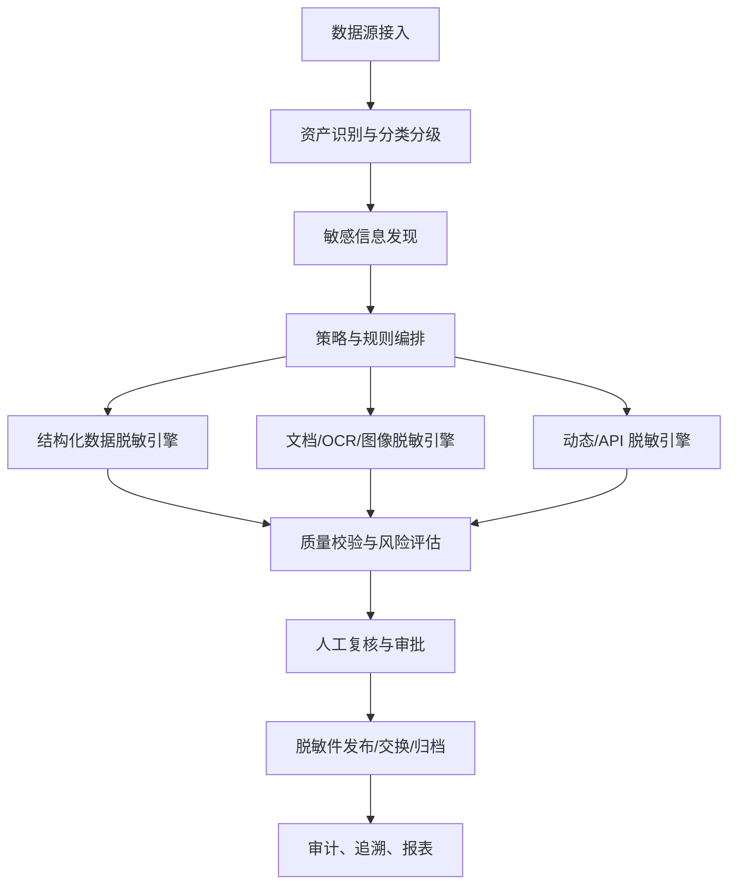

# 跨平台政府档案数据脱敏系统调研报告

调研日期：2026-04-30  
调研范围：成熟数据脱敏产品、数据库/大数据平台原生脱敏能力、开源匿名化/脱敏工具，以及政府档案场景下的完整功能画像。  
说明：本报告基于公开资料调研，未进行商业产品试用或源码深度审计。后续进入设计阶段前，仍需结合真实样例档案、部署环境、合规边界和用户流程做验证。

## 1. 摘要

成熟的数据脱敏系统已经不只是“把字段打星号”。主流产品通常覆盖敏感数据发现、分类分级、脱敏规则与算法库、静态脱敏、动态脱敏、数据子集、测试数据管理、审计报表、权限控制、作业调度和跨数据源连接。Oracle Data Masking and Subsetting 明确把应用数据建模、敏感列发现、格式库、转换库、数据子集和集中管理作为核心能力；IBM Optim 强调跨应用、数据库和操作系统的去标识化，以及格式保持、预置规则、测试沙箱和 API/UDF；Delphix 把敏感信息识别和自动化脱敏扩展到大型机、现代云平台、数据库和文件。

开源生态能提供若干关键部件，但没有一个项目可以直接满足“跨平台政府档案数据脱敏系统”的完整需求。Presidio 适合做文本、图像和结构化数据中的 PII 识别/匿名化基础能力；ARX/Amnesia 更适合面向表格数据发布的 k-匿名、风险评估和数据效用分析；PostgreSQL Anonymizer、Greenmask、Neosync 偏数据库与测试数据管理；Phileas、scrubadub 偏文本/PDF 或自由文本清洗。它们需要组合，并补充档案业务规则、OCR、版式理解、人工复核、审批审计、PDF/Office 真删除、元数据清理和跨平台部署。

政府档案场景的难点在于：档案类型复杂，文书档案、组织人事档案、审计档案、技术档案、诉讼案卷同时存在结构化字段、正文、扫描件、图片、表格、附件、签章、手写内容、二维码、隐藏 OCR 层和文件元数据。系统必须把“敏感信息识别准确率”和“脱敏后仍可用”同时作为核心目标，还要能提供可审计、可复核、可证明的处理链路。

## 2. 概念与边界

### 2.1 常见脱敏方式

| 类型 | 说明 | 典型用途 | 风险点 |
|---|---|---|---|
| 静态脱敏 | 生成永久变形后的副本，原始数据不进入下游环境 | 测试库、数据共享、模型训练、外包加工 | 规则错误会批量污染输出；需校验引用完整性 |
| 动态脱敏 | 查询时按角色、上下文、策略返回遮盖值，原数据不改变 | 生产查询、运维、数据分析平台 | 不能单独替代访问控制；恶意推断仍可能还原部分信息 |
| API/流式脱敏 | 通过服务接口对请求或响应实时脱敏 | 数据交换、开放接口、AI 调用前置过滤 | 延迟、吞吐、策略版本一致性 |
| 去标识化/假名化 | 移除或替换直接标识符，通常仍可能被重新识别 | 内部共享、受控分析 | 在中国个人信息保护语境下，去标识化信息仍可能属于个人信息 |
| 匿名化 | 处理后无法识别特定自然人且不能复原 | 公开发布、开放数据 | 实际证明难度高，需风险评估 |
| 可逆脱敏 | 加密、令牌化、格式保持加密等可通过密钥恢复 | 受控第三方处理、回流对账 | 密钥管理成为最高风险点 |
| 不可逆脱敏 | 替换、泛化、抑制、扰动、哈希加盐、真删除 | 公开、测试、低信任环境 | 可能损失业务效用 |
| 合成数据 | 生成结构和统计特征相似但不含真实个体的数据 | 测试、演示、补充边界样本 | 不等于天然匿名，需防成员推断和过拟合泄露 |

### 2.2 法规和标准约束

系统设计至少应对齐以下要求：

- 《中华人民共和国个人信息保护法》：区分个人信息、敏感个人信息、去标识化、匿名化；第七十三条定义了去标识化和匿名化概念。来源：[中国人大网](https://www.npc.gov.cn/WZWSREL25wYy9jMi9jMzA4MzQvMjAyMTA4L3QyMDIxMDgyMF8zMTMwODguaHRtbD9yZWY9aW1i)。
- 《中华人民共和国数据安全法》：强调数据分类分级、重要数据保护、国家秘密数据处理适用保密相关法规。来源：[中国人大网](https://www.npc.gov.cn/npc/c2/c30834/202106/t20210610_311888.html)。
- 《中华人民共和国档案法实施条例》：档案管理和利用需要以档案安全为基础。来源：[中国政府网](https://www.gov.cn/zhengce/zhengceku/202401/content_6928164.htm)。
- 《档案信息系统安全保护基本要求》：明确档案信息系统应以档案数据为核心，对不同安全级别档案数据区别管理，涉密系统按国家保密法规和标准执行。来源：[国家档案局](https://www.saac.gov.cn/daj/xxgk/201601/27556e245b4247b09039b0609c78d3ef.shtml)。
- GB/T 37964-2019《信息安全技术 个人信息去标识化指南》：国家标准，当前状态为现行，适合作为去标识化方法和评估的基础参考。来源：[全国标准信息公共服务平台](https://openstd.samr.gov.cn/bzgk/std/newGbInfo?hcno=C8DF1BC2FB43C6EC0E602EB65EF0BC66&refer=outter)。

对本项目的直接影响：

- 涉密档案不应进入普通非涉密脱敏系统。涉密处理需要单独的涉密系统、环境、流程和人员资质。
- “脱敏后可公开”不能仅由算法声称，应有规则审批、人工复核、风险评估和输出验证。
- 档案系统需要保留原件、脱敏件、处理记录和审批证据的对应关系，但普通使用者不能通过该对应关系反推原始敏感信息。

## 3. 成熟系统调研

### 3.1 商业和平台型产品

| 产品/平台 | 定位 | 公开资料体现的能力 | 对本项目的启发 | 注意点 |
|---|---|---|---|---|
| Oracle Data Masking and Subsetting | 数据库静态脱敏和测试数据管理 | 敏感列发现、父子关系发现、应用数据模型、格式库、转换库、数据子集、应用模板、In-Database/In-Export/异构数据库模式 | 结构化档案库必须有“数据关系模型”，不能只按单字段处理 | 偏 Oracle 生态，异构场景需要网关/中转 |
| IBM InfoSphere Optim Data Privacy | 企业级数据隐私与测试数据保护 | 跨应用、数据库、操作系统去标识化；格式保持；预置分类和规则；合规报告；FPE/AES-256、API/UDF | 规则库、格式保持和企业应用集成是成熟系统标配 | 商业闭源，成本和国产化适配需评估 |
| Delphix Continuous Compliance | 持续合规和自动化脱敏 | 识别敏感信息，自动化脱敏，覆盖大型机到现代云平台；支持数据库和文件连接器 | 对跨平台和异构数据源有参考价值，尤其是作业编排和连接器架构 | 商业产品，实际支持范围需按目标环境核验 |
| Informatica Dynamic/Persistent Data Masking | 动态脱敏、持久脱敏、云数据管理 | DDM 位于应用和数据库之间拦截请求并按规则脱敏；持久脱敏用于生成不可识别但保留上下文和引用完整性的测试数据 | 动态脱敏代理模式适合运维查询和旧系统无改造接入 | 代理模式需关注 SQL 兼容性、性能、绕过风险 |
| Broadcom Test Data Manager | 测试数据管理 | PII 扫描、脱敏、审计、数据子集、合成数据、测试数据预留和自助供给 | “脱敏 + 子集 + 合成 + 供给门户”适合开发测试场景 | 它是 TDM 产品，不直接覆盖档案文档脱敏 |
| 华为云 DSC 数据安全中心 | 云上数据安全治理 | 支持静态脱敏和 API 脱敏；覆盖 SQLServer、MySQL、PostgreSQL、人大金仓、达梦、GaussDB、Oracle、Hive、HBase、OBS 文本/图片等 | 国内政务环境应关注国产数据库、对象存储、图片证件、人脸车牌等能力 | 云产品能力需评估私有化、离线、国产化版本 |
| H3C SecPath DM2000-S/D | 国内静态/动态脱敏产品 | 敏感数据自动发现、脱敏方案配置、引导式流程、审计日志、静态和动态产品形态 | 国内产品普遍强调发现、推荐、审计和易用性；可作为采购型对标 | 公开资料偏产品宣传，需实测算法和格式覆盖 |

关键来源：

- Oracle DMS：自动发现敏感数据和父子关系、格式库、转换库、子集、引用完整性、In-Database/In-Export/异构模式。来源：[Oracle Documentation](https://docs.oracle.com/en/database/oracle/oracle-database/19/dmksb/intro.html)。
- IBM Optim：跨应用/数据库/OS 去标识化，格式保持、预置分类和规则、测试沙箱、FPE/AES-256、API/UDF。来源：[IBM](https://www.ibm.com/products/infosphere-optim-data-privacy)。
- Delphix：敏感信息识别和自动化脱敏覆盖大型机到现代云平台。来源：[Delphix Documentation](https://help.delphix.com/cc/index.html)。
- Informatica DDM：位于应用和数据库之间，拦截请求并在返回应用前按规则脱敏。来源：[Informatica Docs](https://docs.informatica.com/data-security-group/dynamic-data-masking/9-9-4/user-guide/introduction-to-dynamic-data-masking/dynamic-data-masking-overview.html)。
- 华为云 DSC：静态脱敏、API 脱敏、多种数据库/大数据/OBS 文件和图片脱敏。来源：[华为云文档](https://support.huaweicloud.com/intl/zh-cn/usermanual-dsc/dsc_01_0037.html)。
- H3C：敏感数据发现、自动脱敏策略推荐、审计等。来源：[H3C 产品资料](https://www.h3c.com/cn/d_202108/1451408_473262_0.htm)。

### 3.2 数据库和大数据平台原生能力

| 平台 | 能力 | 适用场景 | 局限 |
|---|---|---|---|
| SQL Server / Azure SQL Dynamic Data Masking | 对列配置掩码，查询结果对非特权用户脱敏，原数据不改变 | 低改造保护生产查询结果 | Microsoft 明确 DDM 不应单独用于防恶意推断，需要与访问控制、审计、加密、行级安全配合 |
| Snowflake Dynamic Data Masking | 列级安全能力，查询时根据策略、角色和上下文返回明文/部分脱敏/全脱敏 | 云数仓、数据共享、集中治理 | 依赖 Snowflake 企业版能力，不解决离线文档和跨系统副本 |
| Snowflake Tag-based Masking | 将掩码策略绑定标签，一次策略可扩展到大量对象和未来列 | 分类分级驱动的策略治理 | 标签质量和分类准确性决定效果 |
| Apache Ranger | Hive 等生态中的列掩码、行过滤、基于标签的策略 | 大数据平台统一访问控制 | 主要是动态访问治理，不负责离线副本永久脱敏 |
| PostgreSQL Anonymizer | PostgreSQL 扩展，支持声明式掩码规则、动态/静态/备份/副本/视图等策略 | Postgres 生态内的 DB 级脱敏 | 受限于 PostgreSQL，不能处理文档和档案扫描件 |

关键来源：

- SQL Server DDM：来源 [Microsoft Learn](https://learn.microsoft.com/en-us/sql/relational-databases/security/dynamic-data-masking?view=sql-server-ver17)。
- Snowflake DDM 和标签策略：来源 [Snowflake DDM](https://docs.snowflake.com/en/user-guide/security-column-ddm-intro)、[Tag-based Masking](https://docs.snowflake.com/en/user-guide/tag-based-masking-policies)。
- Apache Ranger 行过滤和列掩码：来源 [Apache Ranger Confluence](https://cwiki.apache.org/confluence/pages/viewpage.action?pageId=65868896)。
- PostgreSQL Anonymizer：来源 [项目文档](https://postgresql-anonymizer.readthedocs.io/)。

### 3.3 文档脱敏和红线编辑

政府档案脱敏不能只在可见层画黑框。电子 PDF、Office、扫描 PDF 往往包含可复制文本、OCR 隐藏层、批注、修订历史、嵌入对象、附件、作者信息、EXIF、XMP 元数据等。Adobe Acrobat 的官方红线编辑流程明确包含应用红线后清理隐藏信息，并保存新文件。来源：[Adobe Acrobat Redaction](https://experienceleague.adobe.com/en/docs/document-cloud-learn/acrobat-learning/advanced-tasks/protect/redact)。

对本项目的含义：

- 对 PDF/Office 输出必须做“真删除”或重渲染，不允许只覆盖视觉层。
- 需要对输出文件再次抽取文本、OCR 和元数据，验证敏感信息是否残留。
- 对扫描件应在图像层遮盖敏感区域，并同步删除或重建 OCR 文本层。
- 对含附件的档案包，需要递归扫描和脱敏。

## 4. 开源项目评估

| 项目 | 类型 | 主要能力 | 适配价值 | 缺口/风险 |
|---|---|---|---|---|
| Microsoft Presidio | Python SDK/服务，MIT | 文本、图像、结构化/半结构化 PII 识别和匿名化；支持规则、NER、校验和、上下文、多语言、Docker/Kubernetes、图像 OCR 脱敏 | 可作为非结构化文本和图片脱敏的基础引擎，适合做可插拔识别器 | 官方提醒自动检测不能保证找全；中文政务实体、档案号、案号、职务、政治面貌等需自定义 |
| ARX Data Anonymization Tool | Java 桌面/库 | k-匿名、l-diversity、t-closeness、差分隐私等隐私/风险模型；数据效用和重识别风险分析；支持 CSV、Excel、SQL | 适合做表格数据发布前的风险评估和匿名化算法参考 | 主要处理结构化微数据，不覆盖文档、OCR 和工作流 |
| OpenAIRE Amnesia | Web/后端工具 | 伪匿名化、遮蔽、k-匿名、km-匿名 | 适合低门槛表格匿名化参考 | 功能面窄，难直接作为企业级系统底座 |
| PostgreSQL Anonymizer | PostgreSQL 扩展 | 声明式规则、动态掩码、静态掩码、备份掩码、副本掩码、视图掩码；可用 SECURITY LABEL 定义规则 | 如果后端采用 PostgreSQL，可直接利用 DB 层策略 | 不跨数据库，不处理文件和文档 |
| Greenmask | Go 单二进制，Apache-2.0 | 逻辑数据库 dump、脱敏、合成数据、恢复；PostgreSQL 生产可用，MySQL beta；子集、确定性转换、动态参数、S3 存储、跨平台 | 适合开发测试数据副本、离线 dump 脱敏和 CI/CD | 偏数据库和备份流，不含档案文档、审批、审计门户 |
| Neosync | Go/TypeScript 平台，MIT | PII 匿名化、合成数据、环境同步、子集、引用完整性、GitOps 配置、Postgres/MySQL/S3 集成 | 产品形态很接近“数据供给平台”，可借鉴任务、连接器、UI 和 GitOps | 仓库 2025-08-30 已归档，不再积极维护，新项目不宜直接依赖为核心 |
| Phileas/Philter | Java 文本/PDF 脱敏库/服务，Apache-2.0 | 识别和处理 PII/PHI；策略驱动；支持文本和 PDF，替换、加密、匿名化等 | 文档红线和策略模型有参考价值 | 识别类型偏美国语境；项目体量较小；PDF 输出形态需实测 |
| scrubadub | Python 包 | 自由文本 PII 清洗，姓名、邮箱、电话、地址、信用卡、DOB、URL 等 | 轻量级文本清洗组件，可用于日志或低风险文本 | 不适合独立承担政务档案高风险脱敏 |
| Apache Ranger | 大数据安全治理 | 行过滤、列掩码、标签驱动策略、集中审计 | 大数据平台动态访问控制可集成 | 不是静态脱敏或文档脱敏系统 |

关键来源：

- Presidio：文本、图像、结构化数据的 PII 识别和匿名化，且说明自动识别不能保证找全。来源：[Presidio Docs](https://microsoft.github.io/presidio/)、[GitHub](https://github.com/microsoft/presidio)。
- ARX：开源匿名化工具，支持隐私/风险模型、转换方法、效用分析、跨平台 GUI 和 Java API。来源：[ARX](https://arx.deidentifier.org/)。
- Amnesia：伪匿名、遮蔽、k-匿名、km-匿名。来源：[OpenAIRE Amnesia](https://amnesia.openaire.eu/about/what-is-amnesia.html)。
- PostgreSQL Anonymizer：PostgreSQL 脱敏扩展。来源：[PostgreSQL Anonymizer](https://postgresql-anonymizer.readthedocs.io/)。
- Greenmask：数据库 dump、匿名化、合成数据、子集、确定性转换、跨平台单二进制。来源：[Greenmask GitHub](https://github.com/GreenmaskIO/greenmask)。
- Neosync：PII 匿名化、合成数据、环境同步；仓库已归档。来源：[Neosync GitHub](https://github.com/nucleuscloud/neosync)。
- Phileas：PII/PHI 文本和 PDF 脱敏策略库。来源：[Phileas GitHub](https://github.com/philterd/phileas)。
- scrubadub：自由文本 PII 清洗。来源：[scrubadub Docs](https://scrubadub.readthedocs.io/)。

## 5. 完整数据脱敏系统的功能画像

### 5.1 总体能力分层

### 5.2 数据源接入

必须支持：

- 关系数据库：Oracle、MySQL、PostgreSQL、SQL Server、人大金仓、达梦、GaussDB 等。
- 大数据：Hive、HBase、DWS、Elasticsearch、对象存储、数据湖文件。
- 文件：PDF、OFD、Word、Excel、WPS、TXT、CSV、HTML、XML、JSON、压缩包。
- 图像和扫描件：JPG、PNG、TIFF、多页 TIFF、扫描 PDF。
- 档案系统和 OA/公文系统接口：REST、SOAP、JDBC/ODBC、文件交换、消息队列、批量导入。
- 元数据：档号、全宗号、案卷号、保管期限、形成单位、题名、责任者、日期、密级、开放状态、利用限制。

建议支持：

- 邮件和附件。
- 音视频转写后的文本脱敏。
- 数据库 dump/备份流脱敏。
- 数据交换 API 网关脱敏。

### 5.3 敏感信息识别

识别能力应包括：

- 直接标识符：姓名、身份证号、护照、军官证、驾驶证、社保号、银行卡、统一社会信用代码。
- 联系方式：手机号、座机、邮箱、地址、邮编、微信/QQ/账号。
- 档案专有标识：档号、案卷号、件号、文号、案号、审批号、合同号、项目编号、设备编号。
- 人事敏感信息：出生日期、民族、籍贯、政治面貌、党团信息、任免、奖惩、考核、处分、家庭成员、工资、履历、健康、学历学位。
- 诉讼/执法敏感信息：当事人、证人、被害人、未成年人信息、证据线索、住址、联系方式、案情细节、裁判文书中的法定脱敏项。
- 审计/财务敏感信息：账户、交易流水、金额、税号、票据、供应商、合同价、问题线索。
- 技术/工程档案敏感信息：坐标、图纸、关键设施位置、设备参数、网络拓扑、工艺参数、专利/商业秘密。
- 图像敏感目标：人脸、身份证/护照/驾驶证照片、车牌、银行卡、二维码、条形码、签名、手印、印章、屏幕截图中的账号。
- 隐含识别风险：多个字段组合后可识别个人或单位，例如“出生年月 + 单位 + 职务 + 事件日期”。

识别方法应采用多引擎组合：

- 正则表达式和校验位：身份证、银行卡、统一社会信用代码、案号等。
- 字典和规则库：行政区划、机关单位、职务、档案术语、行业术语。
- NER/大模型辅助识别：姓名、机构、地点、案情实体、语义敏感片段。
- 版式和模板识别：干部履历表、审批表、判决书、审计报告、合同、证照。
- OCR 和版面分析：扫描件、图片、PDF 图片层。
- 关系推断：根据表关系、字段名、字段值分布、上下文判断敏感类型。
- 人工反馈闭环：误报/漏报样本进入规则和模型迭代。

### 5.4 策略和规则管理

完整系统应支持：

- 按场景定义策略：公开发布、跨部门共享、内部查询、开发测试、数据分析、AI 训练、外包加工、运维。
- 按数据级别定义策略：公开、内部、敏感、重要、核心、涉密另行处理。
- 按用户/角色/组织/时间/网络位置/用途定义动态策略。
- 规则版本管理、灰度发布、审批流和回滚。
- 规则继承和覆盖：全局规则、部门规则、档案门类规则、项目规则。
- 条件脱敏：例如未成年人姓名全遮盖，成年人姓名保留姓氏；公开件遮盖身份证号，内部统计件泛化到年龄段。
- 组合字段一致性：姓名、身份证、出生日期、性别、地址之间保持逻辑一致。
- 跨表/跨文件一致性：同一人、同一单位在同一任务或指定范围内生成稳定假名。
- 黑白名单：保留法定公开信息，强制删除禁止公开信息。
- 可恢复性策略：明确哪些规则可逆、哪些不可逆，可逆规则必须绑定密钥、审批和审计。

### 5.5 脱敏算法库

基础算法：

- 遮盖：全遮盖、部分遮盖、保留前后若干位。
- 替换：随机替换、字典替换、同类实体替换。
- 泛化：年龄段、日期粒度、地址到区县/城市、金额区间。
- 抑制/删除：字段置空、段落删除、页面删除。
- 扰动：数值加噪、日期偏移、随机化。
- 打乱：列内 shuffle、分组内 shuffle。
- 哈希：加盐哈希、HMAC，用于一致映射但不可直接恢复。
- 加密/令牌化：可逆替换、格式保持加密。
- 合成生成：按 schema、统计分布、业务规则生成虚拟数据。
- 差分隐私：统计发布和汇总场景加入隐私预算控制。

档案文档专用算法：

- PDF 文本对象真删除。
- OCR 层删除或重建。
- 图片区域遮盖、模糊、像素化、重绘。
- 表格单元格级脱敏。
- 批注、修订、隐藏层、嵌入附件、宏、对象、元数据清理。
- 公章/签名/手印可按策略保留、遮盖或替换为“已脱敏”标记。
- 二维码/条形码解码后判断是否遮盖或重写。

### 5.6 执行和编排

系统应具备：

- 批处理任务：按数据源、目录、档案批次、全宗、项目执行。
- 增量处理：只处理新增/变更档案。
- 流式/API 处理：对外接口返回前脱敏。
- 预览模式：在不写回的情况下展示命中项和脱敏效果。
- 沙箱运行：先在样本或副本中执行并生成评估报告。
- 任务调度：定时、依赖、重试、失败恢复、断点续跑。
- 分布式执行：大文件、大批量档案、数据库亿级行处理。
- 资源隔离：不同密级、部门、项目使用隔离队列和存储。
- 插件化连接器和算法：便于适配国产数据库、私有档案系统、专有格式。

### 5.7 质量校验和风险评估

成熟系统必须证明“已经脱敏”，而不是只生成一个文件。建议校验包括：

- 脱敏前后差异报告。
- 敏感命中统计：类型、数量、位置、置信度、规则版本。
- 输出二次扫描：对脱敏后文件再次抽文本、OCR、元数据、附件并扫描。
- 隐藏信息检查：PDF/Office 元数据、批注、修订、隐藏层、嵌入对象。
- 结构化约束检查：主外键、唯一性、格式校验、Luhn 校验、身份证校验、日期逻辑。
- 重识别风险评估：k-匿名、l-diversity、t-closeness、唯一组合比例、样本唯一性。
- 数据效用评估：字段分布、统计偏差、业务规则通过率、测试用例覆盖率。
- 抽样人工复核：高风险类型必须人工确认。
- 输出证明：任务 ID、输入哈希、输出哈希、规则版本、审批链、操作者、时间、结果摘要。

### 5.8 人工复核和流程

政府档案不可完全依赖自动化，应提供：

- 命中项列表和原文上下文预览。
- 页面级/段落级/表格单元格级标注。
- 高置信自动通过、低置信人工复核。
- 双人复核或多人会签。
- 复核意见、驳回、补充规则。
- 脱敏前后对照查看，权限严格限制。
- 批量处理和快捷操作。
- 复核抽检和质检报告。

### 5.9 安全和审计

系统自身必须按高安全要求建设：

- 最小权限、RBAC/ABAC、双人审批、权限分离。
- 原始档案加密存储、传输加密、密钥分级管理。
- 可逆脱敏密钥和映射表独立保管，访问需审批。
- 操作审计：登录、查看原文、规则变更、任务执行、下载、导出、审批。
- 防绕过：数据库直连、文件旁路、缓存、临时目录、日志明文输出都要治理。
- 水印和追踪：对输出件注入可见/不可见水印，便于泄露溯源。
- 安全删除：临时文件、OCR 中间件、任务缓存按策略清除。
- 离线部署：支持政务内网、无公网、私有化模型和本地依赖。
- 国产化适配：国产 CPU、操作系统、中间件、数据库和密码算法按项目要求评估。

## 6. 面向政府档案的特殊要求

### 6.1 文书档案

常见风险：

- 文号、责任者、签发人、联系人、联系电话、地址、附件中的个人信息。
- 会议纪要和请示报告中的敏感事项。
- 印章、签名、批注、手写备注。
- 扫描 PDF 的隐藏 OCR 文本。

系统要求：

- 支持公文版式解析和页眉页脚识别。
- 支持附件递归处理。
- 支持保留文号、发文机关等依法公开字段，同时脱敏联系人和个人身份信息。
- 支持按公开范围生成不同版本。

### 6.2 组织人事档案

常见风险：

- 身份证、出生日期、籍贯、民族、政治面貌、家庭成员、履历、奖惩、考核、工资、健康、处分材料。
- 同一人员在多份表格和附件中反复出现，需要一致假名。
- 表格、照片、扫描件和手写内容混合。

系统要求：

- 预置干部履历表、任免审批表、考核表等模板。
- 人员实体解析和跨文件一致映射。
- 对“姓名 + 任职单位 + 任职时间 + 职务”组合识别风险做评估。
- 高风险字段默认人工复核。

### 6.3 审计档案

常见风险：

- 财务账号、交易流水、合同、供应商、个人报销、问题线索、审计证据。
- 金额、时间、单位、项目组合后可能暴露商业秘密或执法线索。

系统要求：

- 金额可按场景保留精确值、区间化或扰动。
- 保持凭证、合同、问题线索之间的引用一致。
- 对外共享版本应隐藏账户和个人信息，内部分析版本可保留统计效用。

### 6.4 技术档案

常见风险：

- 关键设施坐标、工程图纸、设备参数、网络拓扑、工艺路线、源代码、专利和商业秘密。
- 图纸和扫描件中包含大量非文本敏感信息。

系统要求：

- 支持 CAD/PDF 图纸的文本抽取和图像化脱敏。
- 关键位置、坐标和设施名称识别。
- 对技术秘密和国家安全相关信息采用人工确认流程。

### 6.5 诉讼案卷和执法档案

常见风险：

- 当事人、证人、被害人、未成年人、住址、联系方式、证据线索、病史、财产信息。
- 案情描述中通过上下文即可识别个体。

系统要求：

- 预置案号、法院/检察/公安文书、裁判文书常见脱敏规则。
- 识别未成年人、家庭暴力、性侵、医疗、财产等特殊敏感场景。
- 支持整段删除、局部替换和释义保留。

## 7. 推荐的能力优先级

### 7.1 第一阶段必须具备

- 数据源接入：数据库、CSV/Excel、PDF/Office、扫描图片、压缩包。
- OCR 和文档解析：至少覆盖中文印刷体公文、表格、扫描 PDF。
- 敏感信息识别：身份证、手机号、姓名、地址、银行卡、邮箱、组织机构、案号、档号、文号、日期、金额。
- 静态脱敏：结构化数据、文件、图片批量脱敏。
- 文档真删除：PDF/Office 元数据、隐藏层、批注、修订和 OCR 层清理。
- 策略管理：按档案类型和使用场景配置规则。
- 人工复核：命中项确认、批量处理、审批留痕。
- 审计报告：规则版本、任务记录、输出哈希、复核记录。
- 输出校验：二次扫描和元数据检查。
- 私有化部署：不能依赖外部 SaaS 或公网模型。

### 7.2 第二阶段增强

- 动态/API 脱敏。
- 跨库一致性映射和实体解析。
- 数据子集和测试数据管理。
- 合成数据生成。
- k-匿名和重识别风险评估。
- 水印和泄露溯源。
- 多租户和跨部门规则继承。
- 国产数据库/对象存储/档案系统深度适配。
- 低代码规则编辑和模型训练反馈闭环。

### 7.3 第三阶段高级能力

- 多模态大模型辅助识别和复核建议。
- 手写体识别和版式理解。
- CAD/OFD/复杂表单专用解析。
- 联邦学习或隐私计算场景的数据可用不可见。
- 差分隐私统计发布。
- 自动生成公开版、共享版、测试版等多版本档案。

## 8. 建设路线参考

不是最终设计，仅作为下一步讨论输入。

### 8.1 可借鉴的开源组合

- 文本/图片识别：Presidio 作为可插拔识别框架，补充中文 NER、规则、OCR 和档案专用识别器。
- 表格匿名化评估：ARX 或 Amnesia 用于 k-匿名、重识别风险和数据效用评估。
- PostgreSQL 场景：PostgreSQL Anonymizer 用于数据库层动态/静态脱敏。
- 测试数据副本：Greenmask 用于 PostgreSQL/MySQL dump、子集和确定性转换。
- 文档红线参考：Phileas 的策略模型和 PDF 处理思路可参考，但需要实测中文和 PDF 真删除能力。

### 8.2 不建议直接做的事情

- 不建议只用正则表达式覆盖全部档案场景。档案正文和案情描述中大量敏感信息没有固定格式。
- 不建议只在 PDF 上画黑框。必须删除底层文本、OCR 层、批注、修订和元数据。
- 不建议把商业动态脱敏当成完整解决方案。动态脱敏适合查询时保护，不解决已外发副本和公开件。
- 不建议把合成数据等同于匿名数据。合成模型可能泄露训练数据特征，仍需隐私评估。
- 不建议让涉密档案进入普通脱敏流程。涉密系统和非涉密系统必须边界清晰。

## 9. 评估指标

建议后续 PoC 使用以下指标：

| 维度 | 指标 |
|---|---|
| 识别准确性 | 按敏感类型统计 precision、recall、F1；重点看漏报率 |
| OCR 能力 | 中文印刷体、扫描噪声、表格、印章遮挡、低分辨率下的识别召回 |
| 文档安全 | 脱敏后文本抽取、OCR、元数据、附件、隐藏层二次扫描无残留 |
| 数据效用 | 统计分布偏差、业务校验通过率、检索可用性、测试用例覆盖率 |
| 一致性 | 同一实体跨表、跨文件、跨批次映射一致性 |
| 性能 | 每小时处理页数、文件数、数据库行数；失败重试和断点续跑 |
| 审计 | 任务、审批、规则、复核、下载、异常全链路可追溯 |
| 安全 | 权限隔离、密钥管理、临时文件清理、日志脱敏、离线部署 |
| 可扩展 | 新档案类型、新规则、新算法、新数据源接入成本 |

## 10. 下一步建议

建议下一阶段做“需求澄清 + 样本验证 + 原型设计”，不要直接大规模开发。

1. 收集 30 到 50 份脱敏样例，覆盖文书、人事、审计、技术、诉讼案卷，每类包含电子文本、扫描件、表格和附件。
2. 制定敏感信息分类分级词表和规则样例，明确哪些信息公开、共享、测试、分析、AI 训练时分别如何处理。
3. 做一个小型 PoC：输入 PDF/Word/图片/CSV/PostgreSQL 表，输出脱敏件、命中列表、复核界面和审计报告。
4. 用 Presidio/自定义中文规则/OCR/ARX 或等价组件做基线，测出识别漏报、误报、处理性能和文档残留风险。
5. 再进入系统设计：确定部署形态、模块边界、数据模型、任务编排、权限审计、算法插件接口和人机协同流程。

## 11. 参考资料

- [Oracle Data Masking and Subsetting Guide](https://docs.oracle.com/en/database/oracle/oracle-database/19/dmksb/intro.html)
- [IBM InfoSphere Optim Data Privacy](https://www.ibm.com/products/infosphere-optim-data-privacy)
- [Delphix Continuous Compliance Documentation](https://help.delphix.com/cc/index.html)
- [Informatica Dynamic Data Masking Overview](https://docs.informatica.com/data-security-group/dynamic-data-masking/9-9-4/user-guide/introduction-to-dynamic-data-masking/dynamic-data-masking-overview.html)
- [Broadcom Test Data Manager Solution Brief](https://docs.broadcom.com/doc/test-data-manager)
- [Huawei Cloud DSC 数据脱敏概述](https://support.huaweicloud.com/intl/zh-cn/usermanual-dsc/dsc_01_0037.html)
- [H3C 数据静态脱敏系统产品特点](https://www.h3c.com/cn/d_202108/1451408_473262_0.htm)
- [Microsoft SQL Server Dynamic Data Masking](https://learn.microsoft.com/en-us/sql/relational-databases/security/dynamic-data-masking?view=sql-server-ver17)
- [Snowflake Dynamic Data Masking](https://docs.snowflake.com/en/user-guide/security-column-ddm-intro)
- [Snowflake Tag-based Masking Policies](https://docs.snowflake.com/en/user-guide/tag-based-masking-policies)
- [Apache Ranger Row-level Filtering and Column-masking](https://cwiki.apache.org/confluence/pages/viewpage.action?pageId=65868896)
- [PostgreSQL Anonymizer](https://postgresql-anonymizer.readthedocs.io/)
- [Microsoft Presidio](https://microsoft.github.io/presidio/)
- [Presidio GitHub](https://github.com/microsoft/presidio)
- [ARX Data Anonymization Tool](https://arx.deidentifier.org/)
- [OpenAIRE Amnesia](https://amnesia.openaire.eu/about/what-is-amnesia.html)
- [Greenmask GitHub](https://github.com/GreenmaskIO/greenmask)
- [Neosync GitHub](https://github.com/nucleuscloud/neosync)
- [Phileas GitHub](https://github.com/philterd/phileas)
- [scrubadub Documentation](https://scrubadub.readthedocs.io/)
- [Adobe Acrobat Redaction](https://experienceleague.adobe.com/en/docs/document-cloud-learn/acrobat-learning/advanced-tasks/protect/redact)
- [GB/T 37964-2019 信息安全技术 个人信息去标识化指南](https://openstd.samr.gov.cn/bzgk/std/newGbInfo?hcno=C8DF1BC2FB43C6EC0E602EB65EF0BC66&refer=outter)
- [中华人民共和国个人信息保护法](https://www.npc.gov.cn/WZWSREL25wYy9jMi9jMzA4MzQvMjAyMTA4L3QyMDIxMDgyMF8zMTMwODguaHRtbD9yZWY9aW1i)
- [中华人民共和国数据安全法](https://www.npc.gov.cn/npc/c2/c30834/202106/t20210610_311888.html)
- [中华人民共和国档案法实施条例](https://www.gov.cn/zhengce/zhengceku/202401/content_6928164.htm)
- [档案信息系统安全保护基本要求](https://www.saac.gov.cn/daj/xxgk/201601/27556e245b4247b09039b0609c78d3ef.shtml)
