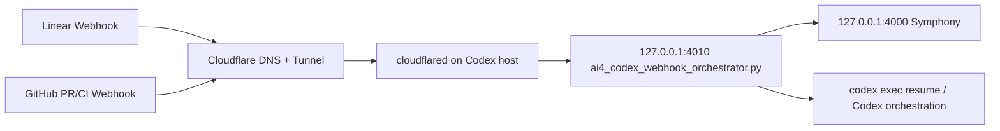

# Cloudflare Domain Tunnel Runbook

This document describes how to expose the webhook-driven Symphony/Codex flow through a Cloudflare-managed domain without opening inbound ports on the Codex machine.

The target ingress is the local ai4archive webhook bridge:

```text
Public HTTPS:
  https://hooks.example.com/api/v1/webhooks/linear
  https://hooks.example.com/api/v1/webhooks/github

Local origin:
  http://127.0.0.1:4010
```

Do not expose the Symphony service on `127.0.0.1:4000` directly. Public ingress, Cloudflare Tunnel, and any reverse proxy must terminate at the `4010` bridge.

## Architecture



Cloudflare Tunnel creates outbound-only connections from the Codex host to Cloudflare. The public hostname maps to a local service such as `http://127.0.0.1:4010`. Official Cloudflare routing docs describe this hostname-to-local-service mapping and the DNS route to `<UUID>.cfargotunnel.com`: https://developers.cloudflare.com/tunnel/routing/

## Required Values

Use placeholders in shared docs and packages. Put real values only in local env files, Cloudflare dashboard settings, GitHub webhook settings, or Linear webhook settings.

| Name | Example | Purpose |
| --- | --- | --- |
| `CF_TUNNEL_NAME` | `ai4archive-webhook` | Cloudflare Tunnel name. |
| `CF_TUNNEL_UUID` | `<uuid>` | Tunnel UUID created by Cloudflare. |
| `CF_PUBLIC_HOSTNAME` | `hooks.example.com` | Public hostname that receives provider webhooks. |
| `AI4_WEBHOOK_HOST` | `127.0.0.1` | Local bridge bind host. Keep loopback. |
| `AI4_WEBHOOK_PORT` | `4010` | Local bridge port. |
| `AI4_LINEAR_WEBHOOK_PATH` | `/api/v1/webhooks/linear` | Linear public path. |
| `AI4_GITHUB_WEBHOOK_PATH` | `/api/v1/webhooks/github` | GitHub public path. |
| `LINEAR_WEBHOOK_SECRET` | local secret | Shared secret for Linear signature verification. |
| `AI4_GITHUB_WEBHOOK_SECRET` | local secret | Shared secret for GitHub `X-Hub-Signature-256`. |

## Local ai4archive Settings

The bridge should stay loopback-only:

```sh
export AI4_WEBHOOK_HOST="127.0.0.1"
export AI4_WEBHOOK_PORT="4010"
export AI4_LINEAR_WEBHOOK_PATH="/api/v1/webhooks/linear"
export AI4_GITHUB_WEBHOOK_PATH="/api/v1/webhooks/github"
export LINEAR_WEBHOOK_SECRET="<linear-webhook-secret>"
export AI4_GITHUB_WEBHOOK_SECRET="<github-webhook-secret>"
```

The enhanced bridge is the required entrypoint for the full unattended flow:

```sh
cd /path/to/symphony-runtime
set -a
. ./.env.symphony.local
set +a
python3 "$CODEX_HOME/skills/ai4archive-symphony-delivery/tools/ai4_codex_webhook_orchestrator.py"
```

Local checks:

```sh
curl -fsS http://127.0.0.1:4010/healthz
curl -fsS http://127.0.0.1:4000/api/v1/state
```

## Option A: Locally Managed Tunnel

Use this when you want the tunnel identity and ingress rules to live on the Codex host in `~/.cloudflared/config.yml`.

1. Install `cloudflared`.

   Follow the official install guide for the target OS. Cloudflare's local tunnel setup starts with installing `cloudflared`, authenticating it, creating a named tunnel, and writing local tunnel credentials: https://developers.cloudflare.com/tunnel/advanced/local-management/create-local-tunnel/

2. Authenticate Cloudflare.

   ```sh
   cloudflared tunnel login
   ```

   Select the Cloudflare zone that owns `example.com`. This creates `cert.pem` under the default `cloudflared` directory.

3. Create a named tunnel.

   ```sh
   cloudflared tunnel create ai4archive-webhook
   ```

   Record the generated tunnel UUID. The command also creates a credentials JSON file, normally under `~/.cloudflared/<UUID>.json`.

4. Create DNS for the public hostname.

   ```sh
   cloudflared tunnel route dns ai4archive-webhook hooks.example.com
   ```

   This creates a Cloudflare DNS CNAME pointing the hostname to the tunnel target. Cloudflare notes that the DNS record and the running tunnel are independent; if the tunnel stops, the hostname can return a tunnel error until the connector is running again.

5. Write `~/.cloudflared/config.yml`.

   ```yaml
   tunnel: <CF_TUNNEL_UUID>
   credentials-file: /Users/<user>/.cloudflared/<CF_TUNNEL_UUID>.json

   ingress:
     - hostname: hooks.example.com
       path: /api/v1/webhooks/linear
       service: http://127.0.0.1:4010
     - hostname: hooks.example.com
       path: /api/v1/webhooks/github
       service: http://127.0.0.1:4010
     - service: http_status:404
   ```

   Cloudflare ingress rules can match hostname, path, or both. Keep the last rule as a catch-all. Official docs also provide `cloudflared tunnel ingress rule` for checking which rule a URL will match: https://developers.cloudflare.com/cloudflare-one/connections/connect-networks/do-more-with-tunnels/local-management/configuration-file/

6. Validate routing locally.

   ```sh
   cloudflared tunnel ingress validate
   cloudflared tunnel ingress rule https://hooks.example.com/api/v1/webhooks/linear
   cloudflared tunnel ingress rule https://hooks.example.com/api/v1/webhooks/github
   cloudflared tunnel ingress rule https://hooks.example.com/unknown
   ```

   The two webhook URLs should route to `http://127.0.0.1:4010`; unknown paths should route to `http_status:404`.

7. Run the tunnel in the foreground first.

   ```sh
   cloudflared tunnel run ai4archive-webhook
   ```

8. Install as a service after foreground validation.

   On macOS, Cloudflare documents two modes:

   ```sh
   cloudflared service install
   ```

   runs at login using `~/.cloudflared/`.

   ```sh
   sudo cloudflared service install
   ```

   runs at boot using `/etc/cloudflared`. If you choose the boot daemon, copy the config and credentials into `/etc/cloudflared` and adjust `credentials-file` accordingly. See the official macOS service guide: https://developers.cloudflare.com/cloudflare-one/connections/connect-networks/do-more-with-tunnels/local-management/as-a-service/macos/

## Option B: Dashboard Managed Tunnel

Use this when you prefer to manage public hostnames from Cloudflare Zero Trust.

1. Cloudflare dashboard: `Zero Trust` -> `Networks` -> `Tunnels`.
2. Create a Cloudflared tunnel named `ai4archive-webhook`.
3. Install the connector on the Codex host using the token command Cloudflare displays. Keep the token out of repos and docs.
4. Add public hostname routes:

   | Public hostname | Path | Service |
   | --- | --- | --- |
   | `hooks.example.com` | `/api/v1/webhooks/linear` | `http://127.0.0.1:4010` |
   | `hooks.example.com` | `/api/v1/webhooks/github` | `http://127.0.0.1:4010` |

5. Do not publish `127.0.0.1:4000` unless it is a separate operator-only hostname protected by Cloudflare Access. Provider webhooks cannot pass Cloudflare Access login, so do not put Access in front of webhook endpoints.

Cloudflare's standard setup guide covers creating the tunnel, adding a public hostname route, and running the connector with a tunnel token: https://developers.cloudflare.com/tunnel/setup/

## Provider Webhook Configuration

### Linear

Configure the Linear webhook endpoint:

```text
URL:    https://hooks.example.com/api/v1/webhooks/linear
Secret: same value as LINEAR_WEBHOOK_SECRET
Events: Issue, Comment
```

The Symphony handler expects:

```text
Header: linear-signature
Header: linear-event
Body:   JSON payload containing webhookTimestamp
```

The local verifier accepts a lowercase hex HMAC-SHA256 signature of the raw request body using `LINEAR_WEBHOOK_SECRET`. The signature may optionally have a `sha256=` prefix.

Manual signed smoke test:

```sh
BODY='{"type":"Issue","action":"update","webhookTimestamp":'$(date +%s000)',"data":{"id":"issue-webhook"}}'
SIG=$(printf '%s' "$BODY" | openssl dgst -sha256 -hmac "$LINEAR_WEBHOOK_SECRET" -binary | xxd -p -c 256)
curl -i \
  -H 'content-type: application/json' \
  -H 'linear-event: Issue' \
  -H "linear-signature: $SIG" \
  --data "$BODY" \
  https://hooks.example.com/api/v1/webhooks/linear
```

A correctly signed test should not return Cloudflare `404`, `502`, `1016`, or `1033`. Application-level `202`, `401`, or `400` responses should be interpreted according to the Symphony webhook logs.

### GitHub

Configure the repository webhook:

```text
Payload URL:  https://hooks.example.com/api/v1/webhooks/github
Content type: application/json
Secret:       same value as AI4_GITHUB_WEBHOOK_SECRET
Events:       pull_request, check_run, check_suite, workflow_run
```

The bridge verifies GitHub `X-Hub-Signature-256` when `AI4_GITHUB_WEBHOOK_SECRET` or `AI4_GITHUB_WEBHOOK_SECRET_FILE` is configured.

Unsigned probe:

```sh
curl -i \
  -H 'content-type: application/json' \
  -H 'X-GitHub-Event: ping' \
  --data '{"zen":"test"}' \
  https://hooks.example.com/api/v1/webhooks/github
```

If a GitHub secret is configured, an unsigned probe should fail with an application-level authorization error rather than a Cloudflare routing error. Use GitHub's webhook redelivery UI for a real signed test.

## Cloudflare Security Rules

The primary security controls are provider signatures and a positive ingress allowlist. Add Cloudflare rules as defense in depth.

Recommended WAF custom rules:

```text
Block non-webhook paths:
if http.host eq "hooks.example.com"
and not http.request.uri.path in {"/api/v1/webhooks/linear" "/api/v1/webhooks/github"}
then block
```

```text
Block non-POST webhook requests:
if http.host eq "hooks.example.com"
and http.request.uri.path in {"/api/v1/webhooks/linear" "/api/v1/webhooks/github"}
and http.request.method ne "POST"
then block
```

Recommended cache rule:

```text
if http.host eq "hooks.example.com" then bypass cache
```

Do not rely on IP allowlists unless you commit to maintaining provider IP ranges. Webhook provider IP ranges can change, and the application signature check is the stable authorization layer.

## Startup Order

1. Start Symphony on `127.0.0.1:4000`.
2. Start the `4010` webhook bridge from the skill-directory script.
3. Confirm local health:

   ```sh
   curl -fsS http://127.0.0.1:4010/healthz
   curl -fsS http://127.0.0.1:4000/api/v1/state
   ```

4. Start `cloudflared`.
5. Confirm external routing:

   ```sh
   curl -i https://hooks.example.com/api/v1/webhooks/github
   curl -i https://hooks.example.com/unknown
   ```

6. Send provider test webhooks from Linear and GitHub.
7. Run compact health:

   ```sh
   python3 "$CODEX_HOME/skills/ai4archive-symphony-delivery/scripts/check_ai4_symphony.py" --compact
   ```

## Troubleshooting

| Symptom | Likely cause | Check |
| --- | --- | --- |
| Cloudflare `1016` | DNS route points to a tunnel that is absent or stopped. | `cloudflared tunnel list`, `cloudflared tunnel info <name>`. |
| Cloudflare `1033` | Tunnel connector is not connected. | Restart `cloudflared`, check service logs. |
| Cloudflare `502` | Tunnel reaches `cloudflared`, but local origin is down. | `curl -fsS http://127.0.0.1:4010/healthz`. |
| External webhook gets `404` | Ingress rule does not match hostname/path or catch-all is reached. | `cloudflared tunnel ingress rule <url>`. |
| Linear returns `401 invalid_signature` | Wrong `LINEAR_WEBHOOK_SECRET` or body changed after signing. | Compare local env and Linear webhook secret. |
| Linear returns `401 stale_webhook` | Payload timestamp outside replay window. | Check host clock and `replay_tolerance_ms`. |
| GitHub returns `401 invalid github signature` | Wrong `AI4_GITHUB_WEBHOOK_SECRET` or unsigned probe. | Use GitHub redelivery with configured secret. |
| Codex does not wake after GitHub event | Bridge is down, lock is stale, pending queue is stuck, or event is not actionable. | Run compact health and inspect `.ai4_codex_webhook` state. |

## Migration Checklist

- Domain nameservers are managed by Cloudflare.
- `cloudflared` is installed on the target Codex host.
- Tunnel exists and has a stable name/UUID.
- `hooks.example.com` routes to the tunnel.
- Ingress only exposes `/api/v1/webhooks/linear` and `/api/v1/webhooks/github` to `127.0.0.1:4010`.
- Catch-all ingress rule returns `http_status:404`.
- `LINEAR_WEBHOOK_SECRET` and `AI4_GITHUB_WEBHOOK_SECRET` exist only in local env/secrets.
- Symphony remains bound to `127.0.0.1:4000`.
- The webhook bridge remains bound to `127.0.0.1:4010`.
- Linear webhook URL is `https://hooks.example.com/api/v1/webhooks/linear`.
- GitHub webhook URL is `https://hooks.example.com/api/v1/webhooks/github`.
- Provider redelivery tests reach the local bridge.
- Compact health reports webhook bridge/process as healthy.
