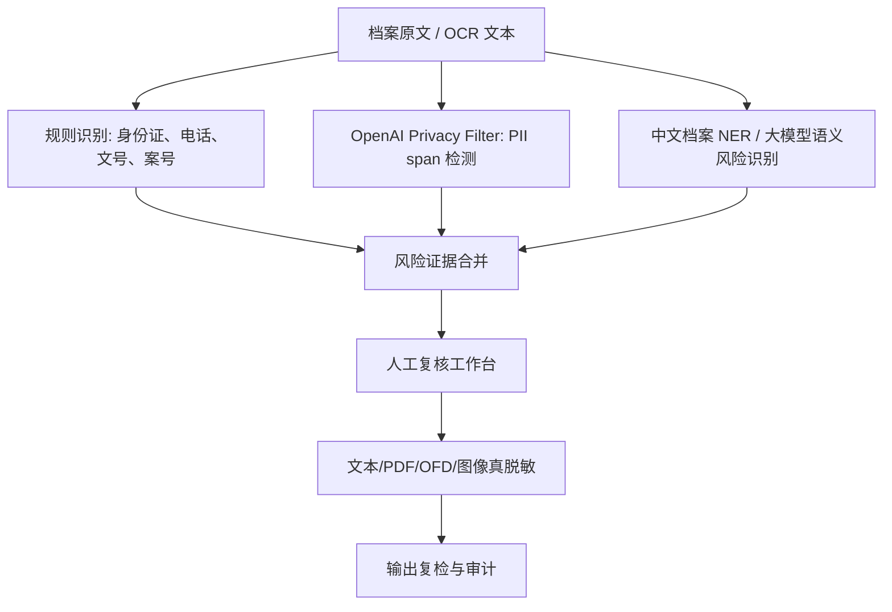

# OpenAI Privacy Filter Demo 项目调研与适配评估

调研日期：2026-05-06  
调研对象：OpenAI `privacy-filter` 模型、官方 Hugging Face Demo、社区 WebGPU Demo。  
调研目标：判断其对档案数据脱敏系统、档案开放 AI 辅助鉴定系统的实现是否有帮助。

## 1. 结论

OpenAI Privacy Filter 对脱敏系统有明确帮助，但应定位为“文本个人信息识别与初步遮盖组件”，不能定位为完整脱敏系统或档案开放鉴定系统。

可直接借鉴的能力包括：

- 本地化 PII 检测：可在本机、内网或浏览器端运行，减少把未脱敏文本发往外部服务的风险。
- Span 级输出：返回敏感片段的标签、起止位置和文本，适合做高亮证据、人工复核、脱敏坐标映射。
- 长文本处理：官方说明支持 128K token 上下文，适合长档案全文、会议记录、日志、卷内目录等。
- 可调精度/召回：通过 BIOES 标签和 Viterbi 解码做连续片段识别，运行时可调整偏向召回或精度。
- 评测和微调流程：仓库提供 `redact`、`eval`、`train` 三类 CLI 能力，便于用本馆标注样本做域内评估和再训练。
- Apache 2.0 许可：有利于实验、定制和商业化集成。

不能直接满足的部分：

- 只覆盖文本中的 PII/Secret，不覆盖国家秘密、工作秘密、国家安全、商业秘密、知识产权、社会稳定等档案开放风险。
- 官方基础标签只有 8 类：`account_number`、`private_address`、`private_email`、`private_person`、`private_phone`、`private_url`、`private_date`、`secret`。
- 主要语言是英语，虽有多语种评测，但中文档案场景必须重新评测和微调。
- Demo 的“redaction”只是文本占位符替换，不等于 PDF/OFD/Word/扫描件的真删除。
- 官方明确提示它不是匿名化工具、不是合规认证，也不能替代高风险场景中的人工审查。

建议：把它纳入第一阶段原型，作为“个人信息识别引擎 A”，与正则规则、中文 NER、档案规则库、OCR 版面坐标、人工复核流程组合使用。不要单独依赖它给出“可开放/不可开放”结论。

## 2. 项目来源与组成

| 组成 | 地址 | 说明 |
|---|---|---|
| 官方介绍 | https://openai.com/es-419/index/introducing-openai-privacy-filter/ | OpenAI 2026-04-22 发布，定位为文本 PII 检测和遮盖的开放权重模型。 |
| 模型权重 | https://huggingface.co/openai/privacy-filter | Hugging Face 模型页，Apache 2.0，支持 Transformers、Transformers.js、ONNX、Safetensors。 |
| 官方源码 | https://github.com/openai/privacy-filter | 本地 CLI、Python API、评测、微调、模型实现。 |
| 官方 Demo | https://huggingface.co/spaces/openai/privacy-filter | Gradio Demo：文本输入、实体高亮、占位符替换。 |
| 社区 WebGPU Demo | https://huggingface.co/spaces/webml-community/privacy-filter-webgpu | 纯浏览器端 Transformers.js + WebGPU 演示，本地推理，不上传文本。 |
| 模型卡 | https://cdn.openai.com/pdf/c66281ed-b638-456a-8ce1-97e9f5264a90/OpenAI-Privacy-Filter-Model-Card.pdf | 架构、标签、评测、限制和风险说明。 |

## 3. 核心技术特征

### 3.1 模型形态

Privacy Filter 是一个双向 token classification 模型，不是生成式模型。它对每个 token 输出隐私标签概率，再通过受约束的 Viterbi 解码形成连续 span。这个设计适合脱敏系统，因为系统需要的是“哪里敏感、属于什么类型、如何遮盖”，不是自然语言回答。

官方公开信息显示：

- 总参数约 1.5B，单次前向活跃参数约 50M。
- 支持 128K token 上下文。
- 使用 BIOES 边界标签，8 个隐私类别扩展为 33 个 token 输出类别。
- 可在本地、笔记本、浏览器 WebGPU 或服务器 GPU 上运行。

### 3.2 输出结构

官方 CLI JSON 输出结构包含：

```json
{
  "schema_version": 1,
  "summary": {
    "output_mode": "typed",
    "span_count": 3,
    "by_label": {
      "private_person": 1,
      "private_date": 2
    },
    "decoded_mismatch": false
  },
  "text": "Alice was born on 1990-01-02.",
  "detected_spans": [
    {
      "label": "private_person",
      "start": 0,
      "end": 5,
      "text": "Alice",
      "placeholder": "<PRIVATE_PERSON>"
    }
  ],
  "redacted_text": "<PRIVATE_PERSON> was born on <PRIVATE_DATE>."
}
```

这类结构对我们的系统很有价值，可以直接映射为：

- 审核证据：页码、段落、字符起止位置、命中类型。
- UI 高亮：在 OCR 文本或版式视图里标注敏感片段。
- 脱敏任务：把字符 span 映射到 PDF/OFD/图像坐标后执行真删除或遮盖。
- 质检复核：输出后重新抽取文本，检查 span 是否残留。

### 3.3 微调与自定义标签

官方仓库支持：

- `opf redact`：本地文本脱敏。
- `opf eval`：对标注数据做评测，支持 typed / untyped 模式。
- `opf train`：对本地标注数据微调。
- `--label-space-json`：训练自定义标签空间。

这一点对档案场景关键。我们不应只用默认 8 类标签，而应构建档案专用标签，例如：

- `personal_name`
- `personal_id`
- `personal_phone`
- `personal_address`
- `minor_info`
- `cadre_personnel_info`
- `health_info`
- `financial_account`
- `case_party`
- `witness_or_victim`
- `secret_or_credential`

但需要注意：官方说明默认模型不能在运行时动态改变标签策略，策略边界不同通常需要重新评测或微调。

## 4. 对档案脱敏系统的帮助

### 4.1 可复用场景

| 场景 | 帮助程度 | 说明 |
|---|---:|---|
| OCR 后全文个人信息识别 | 高 | 适合先在 OCR 文本中找人名、电话、地址、邮箱、日期、账号等。 |
| 文本高亮和人工复核 | 高 | span 输出可直接作为审核工作台证据。 |
| AI 调用前预脱敏 | 高 | 在把文本送入大模型摘要、分类、向量化前先遮盖个人信息。 |
| 日志、导出文件、接口响应脱敏 | 高 | CLI 和 Python API 都适合批处理文本。 |
| 中文政务档案 PII 检测 | 中 | 有基础价值，但必须用中文档案样本评测和微调。 |
| PDF/OFD/Word 真删除 | 中低 | 模型只给文本 span，不处理文件结构、隐藏层、批注、元数据。 |
| 扫描图像区域遮盖 | 中低 | 需要 OCR 坐标映射和图像处理组件配合。 |
| 档案开放鉴定结论 | 低 | 它不能判断国家秘密、国家安全、知识产权、延期开放等法规结论。 |

### 4.2 推荐接入方式

建议在我们的系统中把它放在“内容风险识别层”，而不是“最终脱敏层”：



### 4.3 与规则引擎互补

Privacy Filter 的优势是上下文理解，能发现不完全符合固定格式的姓名、地址、自然语言里的账号或日期。规则引擎的优势是确定性和可解释性，例如：

- 中国居民身份证校验位。
- 统一社会信用代码。
- 档号、案号、文号。
- 手机号、座机号、银行卡号。
- 密级标识和保密期限。

实际系统应采用“规则高精度 + 模型高召回 + 人工复核”的组合。

## 5. 对档案开放 AI 辅助鉴定系统的帮助

Privacy Filter 能帮助判断“是否含个人信息风险”，但不能判断“是否可以开放”。在开放审核中，它应输出一个风险维度：

| 开放审核风险维度 | Privacy Filter 是否覆盖 | 说明 |
|---|---|---|
| 个人信息 | 部分覆盖 | 人名、地址、电话、邮箱、日期、账号等有帮助。 |
| 敏感个人信息 | 部分覆盖 | 身份证、金融账号有部分帮助；健康、履历、处分、家庭成员等需扩展。 |
| 国家秘密/工作秘密 | 基本不覆盖 | 需要保密规则库、密级元数据、涉密语义模型。 |
| 国家安全/重大利益 | 不覆盖 | 需要档案开放规则和专业分类。 |
| 知识产权/商业秘密 | 不覆盖 | 需合同、技术方案、财务、供应商、图纸等专项识别。 |
| 档案实体安全 | 不覆盖 | 属于档案管理状态和利用规则。 |
| 形成单位协同意见 | 不覆盖 | 属于业务流程和权责机制。 |

因此，它适合成为辅助结论中的一个证据来源：

```json
{
  "risk_type": "personal_information",
  "engine": "openai_privacy_filter",
  "label": "private_phone",
  "text": "13800138000",
  "start": 128,
  "end": 139,
  "confidence": 0.97,
  "suggestion": "脱敏后开放或人工确认"
}
```

最终“拟开放 / 拟延期开放 / 拟脱敏后开放 / 拟暂缓提供”仍应由档案开放规则库和人工审核流程决定。

## 6. Demo 形态评估

### 6.1 官方 Gradio Demo

官方 Demo 的功能很轻：

- 输入文本。
- 调用模型预测 span。
- 用 `gr.HighlightedText` 高亮实体。
- 生成替换后的 redacted text。
- 展示实体数量统计。

对我们有帮助的是交互模式：审核员应该能在一个界面里看到原文、高亮、脱敏结果和类型统计。

不足：

- 只处理纯文本。
- 没有批量任务。
- 没有权限、审计、审批、版本、规则库。
- Demo 在 Hugging Face Space 上运行，不适合处理真实未开放档案。

### 6.2 WebGPU Demo

社区 WebGPU Demo 使用 Transformers.js：

```javascript
const ner = await pipeline("token-classification", "openai/privacy-filter", {
  device: "webgpu",
  dtype: "q4"
});
const output = await ner(text, {
  ignore_labels: [],
  aggregation_strategy: "simple"
});
```

它的价值在于证明：PII 检测可以在浏览器本地执行，文本不上传服务器。这对“客户端预检”“外发前自查”“轻量脱敏工具”有启发。

但对档案馆生产系统，浏览器端推理只适合辅助场景：

- 模型权重下载、浏览器兼容性、显存和性能不稳定。
- 难以做集中审计、统一模型版本和统一规则管理。
- 不适合批量处理海量馆藏全文。
- 对政务内网、信创终端、浏览器 WebGPU 支持要单独验证。

## 7. 风险与限制

### 7.1 高风险场景不能单独使用

官方模型卡和模型页明确提示：Privacy Filter 是 redaction/data minimization aid，不是匿名化、合规或安全保证；医疗、法律、金融、人力资源、教育和政府场景需要额外谨慎、域内评估和人工复核。

这与我们的档案场景完全吻合。档案开放属于高风险政府工作，不能把它作为“自动脱敏通过”的依据。

### 7.2 中文和档案领域必须实测

官方模型页说明主要语言是英语，并提示非英语、非拉丁文字、地域姓名、领域外文本性能可能下降。模型卡中普通中文合成评测 F1 约 0.917，但在“类别线索与 PII 距离较远”的多语种测试中，中文 precision 约 0.926、recall 约 0.786，说明长距离上下文推理仍有明显风险。

档案文本还有额外困难：

- OCR 错字、断行、页眉页脚、表格错列。
- 历史人名、繁体字、异体字、少数民族姓名。
- 公文格式、批示、手写签名、印章、附件。
- “职务 + 单位 + 事件”组合识别风险。
- 个人信息和公共职务信息的边界需要政策判断。

### 7.3 标签体系不足

默认 8 类标签太粗，不能覆盖中国档案脱敏需要。例如：

- 身份证号、护照号、军官证号需要单独类型。
- 人事档案中的政治面貌、处分、工资、履历、家庭成员需要单独规则。
- 诉讼/执法档案中的当事人、证人、被害人、未成年人需要单独规则。
- 图纸、坐标、关键设施、网络拓扑不属于 PII，但可能不宜开放。

### 7.4 “文本遮盖”不等于“文件脱敏”

Demo 输出的 `redacted_text` 只是替换文本。真正档案脱敏还需要：

- PDF/OFD 文本对象真删除。
- OCR 隐藏层删除或重建。
- 图像区域遮盖并重新渲染。
- Office 批注、修订、隐藏文本、元数据、附件清理。
- 输出后复检，防止复制、搜索、元数据中残留敏感信息。

## 8. 适配建议

### 8.1 第一阶段 POC

建议做一个小型验证：

1. 准备 200-500 页已脱敏或可测试的中文档案 OCR 文本。
2. 标注个人信息 span：姓名、身份证、电话、地址、日期、账号、家庭成员、职务相关个人信息。
3. 用 OPF 原模型跑 `opf eval`，记录 precision、recall、F1、漏报样例。
4. 与规则引擎结果合并，比较“规则单独”和“规则 + OPF”的召回变化。
5. 选 50 页做人工工作台原型，高亮 OPF span 和规则 span。
6. 决定是否进行中文档案样本微调。

### 8.2 工程接入方案

推荐优先做服务端/内网本地部署：

- 在内网 GPU 服务器或 CPU 服务器部署 OPF Python 服务。
- 接收纯文本和任务 ID，不直接接收原始文件。
- 返回 span 列表、标签、置信度、模型版本、解码配置。
- 调用方负责把 span 映射回档案页、OCR 坐标和文件脱敏任务。
- 所有请求、响应、模型版本、规则版本进入审计日志。

浏览器 WebGPU 可作为可选能力：

- 用于单件文本预检。
- 用于演示本地化隐私保护。
- 用于低敏场景的客户端辅助脱敏。

### 8.3 与现有调研文档的关系

在当前脱敏系统设计中，建议把 OpenAI Privacy Filter 放入“敏感信息识别引擎池”：

- `RuleDetector`：身份证、电话、密级、文号、案号等。
- `OPFDetector`：上下文 PII、自然语言地址、姓名、账号、secret。
- `ArchiveNERDetector`：档案领域实体。
- `LLMRiskClassifier`：开放审核语义风险分类。
- `HumanReview`：高风险最终确认。

## 9. 是否采用

建议采用，但采用方式要克制：

- 采用：作为文本个人信息检测的可插拔组件。
- 采用：借鉴其 JSON span schema、评测流程、微调流程和本地化部署思路。
- 采用：在审核工作台中借鉴高亮、实体统计、redacted preview。
- 不采用：不把官方 Demo 当作生产系统基础。
- 不采用：不让 OPF 独立决定档案开放结论。
- 不采用：不以 `redacted_text` 替代正式 PDF/OFD/Office/图像脱敏输出。

下一步可以做一个最小验证：基于 OPF 输出格式，设计我们自己的 `SensitiveSpan` 数据结构和中文档案样本评测集，然后接入档案脱敏原型。

## 10. 主要参考来源

- OpenAI 官方介绍：https://openai.com/es-419/index/introducing-openai-privacy-filter/
- Hugging Face 模型页：https://huggingface.co/openai/privacy-filter
- GitHub 源码：https://github.com/openai/privacy-filter
- 官方 Demo：https://huggingface.co/spaces/openai/privacy-filter
- WebGPU Demo：https://huggingface.co/spaces/webml-community/privacy-filter-webgpu
- 模型卡 PDF：https://cdn.openai.com/pdf/c66281ed-b638-456a-8ce1-97e9f5264a90/OpenAI-Privacy-Filter-Model-Card.pdf
